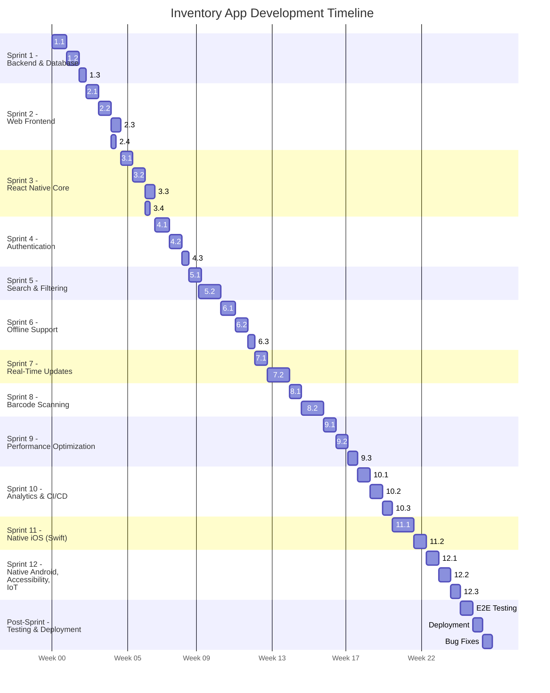

# Inventory App Agile Plan

## Introduction

This Agile plan outlines the development roadmap for the Inventory App, a cross-platform application for managing inventories across domains like warehouse, retail, and personal collections. The app includes web (Vue.js), mobile (React Native, with native Swift for iOS and Kotlin for Android), and backend (Express.js, MongoDB) components. The plan incorporates core CRUD functionality and 12 enhancements (authentication, search, offline support, WebSockets, barcode scanning, analytics, internationalization, CI/CD, performance, IoT, accessibility, and native mobile transition) as specified in the comprehensive design document. Using the Scrum framework, development is divided into 12 two-week sprints (14 project days each, totaling 168 project days), plus 13 days for final testing and deployment, for a total of 181 project days.

## Project Scope

- **Core Features**:
  - CRUD operations (add, view, edit, delete index).
  - Web frontend with Vue.js, modals, and custom PostCSS styles.
  - Mobile frontend with React Native, transitioning to Swift (iOS) and Kotlin (Android).
  - Express.js REST API with MongoDB.
- **Enhancements**:
  - Authentication, search/filtering, offline support, WebSockets, barcode scanning, analytics dashboard, internationalization, CI/CD, performance optimization, IoT integration, accessibility, native mobile transition.
- **Timeline**: 181 project days (168 for sprints, 13 for final testing/deployment).
- **Team**: 10 members (2 frontend, 2 backend, 2 Swift iOS, 2 Android, 1 QA, 1 DevOps).

## Agile Methodology

- **Framework**: Scrum.
- **Sprint Duration**: 14 project days (2 weeks).
- **Ceremonies**:
  - **Sprint Planning**: Define sprint goals and backlog (2 hours).
  - **Daily Standups**: 15-minute sync on progress/blockers.
  - **Sprint Review**: Demo features, gather feedback (2 hours).
  - **Sprint Retrospective**: Reflect on process improvements (1 hour).
- **Artifacts**:
  - **Product Backlog**: All features/enhancements.
  - **Sprint Backlog**: Selected index per sprint.
  - **Increment**: Potentially shippable product at sprint end.

## Team Structure

- **Frontend Developers (2)**: Specialize in Vue.js and web accessibility; now using custom PostCSS styles instead of TailwindCSS.
- **Backend Developers (2)**: Focus on Express.js, MongoDB, and API integrations (WebSockets, IoT).
- **Swift iOS Developers (2)**: Develop native iOS app with SwiftUI, handle iOS-specific features (e.g., Core Data, AVFoundation).
- **Android Developers (2)**: Develop native Android app with Jetpack Compose, handle Android-specific features (e.g., CameraX).
- **QA Engineer (1)**: Conducts unit, integration, and end-to-end testing.
- **DevOps Engineer (1)**: Manages CI/CD pipeline and deployments.

## Epics

The project is divided into 6 epics:

1. **Core Inventory Functionality**: CRUD operations, basic UI, API.
2. **Security and Authentication**: JWT-based authentication, RBAC.
3. **Advanced Features**: Search, offline support, WebSockets, barcode scanning, analytics, internationalization.
4. **Performance and Scalability**: Pagination, caching, optimization.
5. **Integrations and Accessibility**: IoT integration, accessibility enhancements.
6. **Native Mobile Transition and CI/CD**: Swift iOS, Kotlin Android, automated testing/deployment.

## Product Backlog

The backlog lists user stories, acceptance criteria, story points (Fibonacci: 1, 2, 3, 5, 8), and MoSCoW prioritization.

### Epic 1: Core Inventory Functionality
- **User Story 1.1**: As a user, I want to add an item to the inventory so I can track new stock.
  - **Acceptance Criteria**:
    - Form with name (required), quantity (required, ≥0), location (optional), description (optional).
    - POST /api/server saves item to MongoDB.
    - Success message displayed.
  - **Story Points**: 5
  - **Priority**: Must-have
- **User Story 1.2**: As a user, I want to view a list of index so I can see current inventory.
  - **Acceptance Criteria**:
    - GET /api/server returns item list.
    - Web: Rendered in ItemList.vue with ItemCard.vue.
    - Mobile: Displayed in FlatList (React Native).
  - **Story Points**: 3
  - **Priority**: Must-have
- **User Story 1.3**: As a user, I want to edit an item so I can update details.
  - **Acceptance Criteria**:
    - GET /api/server/:id fetches item.
    - PUT /api/server/:id updates item.
    - Pre-filled form in EditItemModal.vue and EditItem.js.
  - **Story Points**: 5
  - **Priority**: Must-have
- **User Story 1.4**: As a user, I want to delete an item so I can remove obsolete stock.
  - **Acceptance Criteria**:
    - DELETE /api/server/:id removes item.
    - Confirmation prompt before deletion.
  - **Story Points**: 3
  - **Priority**: Must-have
- **User Story 1.5**: As a developer, I want a MongoDB schema for index so data is structured.
  - **Acceptance Criteria**:
    - Schema includes name, quantity, location, description, sku, category, createdAt, updatedAt.
    - Text indexes on name, location; sparse index on sku.
  - **Story Points**: 2
  - **Priority**: Must-have

### Epic 2: Security and Authentication
- **User Story 2.1**: As a user, I want to log in so only authorized users access the app.
  - **Acceptance Criteria**:
    - POST /api/auth/login returns JWT.
    - Login forms in Vue.js (Login.vue), React Native (Login.js).
    - Token stored securely (localStorage, AsyncStorage).
  - **Story Points**: 8
  - **Priority**: Must-have
- **User Story 2.2**: As an admin, I want role-based access so I can restrict actions.
  - **Acceptance Criteria**:
    - Roles: admin, manager, viewer.
    - Middleware restricts DELETE to admins.
    - UI hides restricted actions.
  - **Story Points**: 5
  - **Priority**: Must-have

### Epic 3: Advanced Features
- **User Story 3.1**: As a user, I want to search and filter index so I can find stock quickly.
  - **Acceptance Criteria**:
    - GET /api/server?name=X&category=Y supports filtering.
    - Search/filter UI in HomePage.vue and HomePage.js.
  - **Story Points**: 5
  - **Priority**: Should-have
- **User Story 3.2**: As a mobile user, I want to work offline so I can manage inventory without internet.
  - **Acceptance Criteria**:
    - Local storage (IndexedDB, AsyncStorage).
    - POST /api/sync handles batched updates.
    - Background sync when online.
  - **Story Points**: 8
  - **Priority**: Should-have
- **User Story 3.3**: As a user, I want real-time updates so I see team changes instantly.
  - **Acceptance Criteria**:
    - Socket.io broadcasts create/update/delete events.
    - Clients update UI in real-time.
  - **Story Points**: 5
  - **Priority**: Should-have
- **User Story 3.4**: As a mobile user, I want to scan barcodes so I can add/update index quickly.
  - **Acceptance Criteria**:
    - GET /api/server/by-sku retrieves item.
    - Scanning via getUserMedia (web), vision-camera (React Native).
  - **Story Points**: 5
  - **Priority**: Should-have
- **User Story 3.5**: As a manager, I want an analytics dashboard so I can monitor stock trends.
  - **Acceptance Criteria**:
    - GET /api/analytics/summary returns category totals.
    - Charts in Dashboard.vue and Dashboard.js.
  - **Story Points**: 5
  - **Priority**: Could-have
- **User Story 3.6**: As a user, I want multi-language support so I can use my native language.
  - **Acceptance Criteria**:
    - UI translations (vue-i18n, i18next).
    - Item translations in schema.
  - **Story Points**: 5
  - **Priority**: Could-have

### Epic 4: Performance and Scalability
- **User Story 4.1**: As a user, I want fast item loading so I can work efficiently.
  - **Acceptance Criteria**:
    - Pagination in GET /api/server.
    - Redis caching for queries.
    - Virtual scrolling in Vue.js, optimized FlatList in React Native.
  - **Story Points**: 5
  - **Priority**: Should-have

### Epic 5: Integrations and Accessibility
- **User Story 5.1**: As a warehouse manager, I want IoT integration so I can track index via RFID.
  - **Acceptance Criteria**:
    - POST /api/iot/rfid updates quantities.
    - Mobile apps connect to RFID scanners.
  - **Story Points**: 8
  - **Priority**: Could-have
- **User Story 5.2**: As a user with disabilities, I want accessible interfaces so I can use the app.
  - **Acceptance Criteria**:
    - WCAG-compliant UI (ARIA, accessibilityLabel).
    - Tested with VoiceOver, TalkBack.
  - **Story Points**: 5
  - **Priority**: Should-have

### Epic 6: Native Mobile Transition and CI/CD
- **User Story 6.1**: As a mobile user, I want a native iOS app for a fast, authentic experience.
  - **Acceptance Criteria**:
    - SwiftUI app with core CRUD.
    - Integrates with API via URLSession.
  - **Story Points**: 8
  - **Priority**: Could-have
- **User Story 6.2**: As a mobile user, I want a native Android app for a fast, authentic experience.
  - **Acceptance Criteria**:
    - Jetpack Compose app with core CRUD.
    - Integrates with API via Retrofit.
  - **Story Points**: 8
  - **Priority**: Could-have
- **User Story 6.3**: As a developer, I want a CI/CD pipeline to automate testing/deployment.
  - **Acceptance Criteria**:
    - GitHub Actions for Jest, Vitest, Cypress, Detox, XCTest, JUnit.
    - Deploys web to Netlify, backend to AWS.
  - **Story Points**: 5
  - **Priority**: Should-have

## Sprint Plan with Detailed Task Breakdown

Each sprint lasts 14 project days, with tasks broken down into sub-tasks, estimated hours, and assigned roles. QA activities are concurrent within sprints. Total hours assume a 40-hour workweek per developer (80 hours per pair).

### Sprint 1 (Day 1–14): Core Backend and Database
- **Goal**: Set up Express.js API and MongoDB schema.
- **Stories**: 1.5 (MongoDB schema, 2 points), 1.1 (Add Item API, 5 points, partial), 1.2 (View Items API, 3 points, partial)
- **Tasks**:
  - **Task 1: Implement Item schema (2 points, 16 hours, Backend)**
    - Define schema with Mongoose (8 hours).
    - Add text/sparse indexes (4 hours).
    - Write Jest unit tests (4 hours).
  - **Task 2: Create POST /api/server endpoint (2 points, 16 hours, Backend)**
    - Implement route handler (6 hours).
    - Add input validation (4 hours).
    - Write Supertest integration tests (6 hours).
  - **Task 3: Create GET /api/server endpoint (1 point, 8 hours, Backend)**
    - Implement route handler (4 hours).
    - Write integration tests (4 hours).
- **Total Points**: 5
- **Total Hours**: 40 (Backend: 40, QA: 4 for concurrent test review)
- **Deliverable**: Functional backend API for adding/viewing index.
- **Assigned Roles**: Backend (2), QA (1)

### Sprint 2 (Day 15–28): Web Frontend (Vue.js) Core
- **Goal**: Build Vue.js frontend for core CRUD.
- **Stories**: 1.1 (Add Item UI, 5 points, partial), 1.2 (View Items UI, 3 points), 1.3 (Edit Item UI, 5 points, partial), 1.4 (Delete Item UI, 3 points)
- **Tasks**:
  - **Task 1: Create HomePage.vue and ItemList.vue (2 points, 16 hours, Frontend)**
    - Set up Vue Router and HomePage.vue (6 hours).
    - Implement ItemList.vue with ItemCard.vue using custom PostCSS styles instead of TailwindCSS (6 hours).
    - Write Vitest unit tests (4 hours).
  - **Task 2: Implement AddItemModal.vue (2 points, 16 hours, Frontend)**
    - Create modal with form using custom PostCSS styles instead of TailwindCSS (6 hours).
    - Integrate POST /api/server via Axios (6 hours).
    - Write Cypress E2E tests (4 hours).
  - **Task 3: Implement EditItemModal.vue (2 points, 16 hours, Frontend)**
    - Create modal with pre-filled form using custom PostCSS styles instead of TailwindCSS (6 hours).
    - Integrate GET/PUT /api/server/:id (6 hours).
    - Write E2E tests (4 hours).
  - **Task 4: Add delete functionality (1 point, 8 hours, Frontend)**
    - Add delete button with prompt (4 hours).
    - Integrate DELETE /api/server/:id (4 hours).
- **Total Points**: 7
- **Total Hours**: 56 (Frontend: 56, QA: 8 for concurrent test review)
- **Deliverable**: Web app with basic CRUD.
- **Assigned Roles**: Frontend (2), QA (1)
- **Dependencies**: Sprint 1 (backend API)

### Sprint 3 (Day 29–42): React Native Mobile Core
- **Goal**: Build React Native app for core CRUD.
- **Stories**: 1.1, 1.2, 1.3, 1.4 (Mobile UI)
- **Tasks**:
  - **Task 1: Create HomePage.js and ItemList.js (2 points, 16 hours, Swift/Android)**
    - Set up React Navigation and HomePage.js (6 hours).
    - Implement ItemList.js with FlatList (6 hours).
    - Write Jest unit tests (4 hours).
  - **Task 2: Implement AddItem.js (2 points, 16 hours, Swift/Android)**
    - Create form screen (6 hours).
    - Integrate POST /api/server (6 hours).
    - Write Detox E2E tests (4 hours).
  - **Task 3: Implement EditItem.js (2 points, 16 hours, Swift/Android)**
    - Create pre-filled form screen (6 hours).
    - Integrate GET/PUT /api/server/:id (6 hours).
    - Write E2E tests (4 hours).
  - **Task 4: Add delete functionality (1 point, 8 hours, Swift/Android)**
    - Add delete button with alert (4 hours).
    - Integrate DELETE /api/server/:id (4 hours).
- **Total Points**: 7
- **Total Hours**: 56 (Swift: 28, Android: 28, QA: 8 for concurrent test review)
- **Deliverable**: Mobile app with basic CRUD.
- **Assigned Roles**: Swift (1), Android (1), QA (1)
- **Dependencies**: Sprint 1 (backend API)

### Sprint 4 (Day 43–56): Authentication
- **Goal**: Implement JWT-based authentication and RBAC.
- **Stories**: 2.1 (Login, 8 points), 2.2 (RBAC, 5 points)
- **Tasks**:
  - **Task 1: Create User schema and /api/auth endpoints (3 points, 24 hours, Backend)**
    - Define User schema with bcrypt (8 hours).
    - Implement /api/auth/login and /api/auth/register (8 hours).
    - Write tests (8 hours).
  - **Task 2: Implement login UI (3 points, 24 hours, Frontend/Swift/Android)**
    - Create Login.vue (8 hours, Frontend).
    - Create Login.js for React Native (8 hours, Swift/Android).
    - Integrate token storage (8 hours, Frontend/Swift/Android).
  - **Task 3: Add RBAC middleware and UI restrictions (2 points, 16 hours, Backend/Frontend)**
    - Implement auth middleware (8 hours, Backend).
    - Add role-based UI logic (8 hours, Frontend).
- **Total Points**: 8
- **Total Hours**: 64 (Backend: 24, Frontend: 16, Swift: 8, Android: 8, QA: 8 for concurrent test review)
- **Deliverable**: Secure app with login and roles.
- **Assigned Roles**: Backend (2), Frontend (1), Swift (1), Android (1), QA (1)
- **Dependencies**: Sprints 1–3 (backend, frontend, mobile)

### Sprint 5 (Day 57–70): Search and Filtering
- **Goal**: Add advanced search and filtering.
- **Stories**: 3.1 (Search/Filter, 5 points)
- **Tasks**:
  - **Task 1: Extend GET /api/server with query parameters (2 points, 16 hours, Backend)**
    - Add query parameter support (8 hours).
    - Write tests (8 hours).
  - **Task 2: Add search/filter UI (3 points, 28 hours, Frontend/Swift/Android)**
    - Implement search bar in HomePage.vue using custom PostCSS styles instead of TailwindCSS (10 hours, note: increased from 8 hours due to manual styling).
    - Implement search bar in HomePage.js (8 hours, Swift/Android).
    - Add filter dropdowns (10 hours, Frontend/Swift/Android, note: increased from 8 hours due to manual styling).
- **Total Points**: 5
- **Total Hours**: 44 (Backend: 16, Frontend: 14, Swift: 6, Android: 6, QA: 4 for concurrent test review)
- **Deliverable**: Searchable inventory.
- **Assigned Roles**: Backend (1), Frontend (1), Swift (1), Android (1), QA (1)
- **Dependencies**: Sprints 1–3 (backend, frontend, mobile)

### Sprint 6 (Day 71–84): Offline Support
- **Goal**: Enable offline mode with sync.
- **Stories**: 3.2 (Offline Support, 8 points)
- **Tasks**:
  - **Task 1: Implement POST /api/sync endpoint (3 points, 24 hours, Backend)**
    - Create endpoint with conflict resolution (12 hours).
    - Write tests (12 hours).
  - **Task 2: Add local storage (3 points, 24 hours, Frontend/Swift/Android)**
    - Implement IndexedDB with dexie.js (8 hours, Frontend).
    - Implement AsyncStorage for React Native (8 hours, Swift/Android).
    - Write tests (8 hours, Frontend/Swift/Android).
  - **Task 3: Set up background sync (2 points, 16 hours, Swift/Android)**
    - Integrate react-native-background-fetch (8 hours).
    - Write tests (8 hours).
- **Total Points**: 8
- **Total Hours**: 64 (Backend: 24, Frontend: 12, Swift: 14, Android: 14, QA: 8 for concurrent test review)
- **Deliverable**: Offline-capable mobile app.
- **Assigned Roles**: Backend (2), Frontend (1), Swift (1), Android (1), QA (1)
- **Dependencies**: Sprints 1–3 (backend, frontend, mobile)

### Sprint 7 (Day 85–98): Real-Time Updates
- **Goal**: Add WebSocket-based real-time updates.
- **Stories**: 3.3 (WebSockets, 5 points)
- **Tasks**:
  - **Task 1: Integrate socket.io in backend (2 points, 16 hours, Backend)**
    - Set up socket.io server (8 hours).
    - Write tests (8 hours).
  - **Task 2: Add WebSocket listeners (3 points, 24 hours, Frontend/Swift/Android)**
    - Implement socket.io-client in Vue.js (8 hours, Frontend).
    - Implement socket.io-client in React Native (8 hours, Swift/Android).
    - Write tests (8 hours, Frontend/Swift/Android).
- **Total Points**: 5
- **Total Hours**: 40 (Backend: 16, Frontend: 12, Swift: 6, Android: 6, QA: 4 for concurrent test review)
- **Deliverable**: Real-time inventory updates.
- **Assigned Roles**: Backend (1), Frontend (1), Swift (1), Android (1), QA (1)
- **Dependencies**: Sprints 1–3 (backend, frontend, mobile)

### Sprint 8 (Day 99–112): Barcode Scanning
- **Goal**: Implement barcode/QR code scanning.
- **Stories**: 3.4 (Barcode Scanning, 5 points)
- **Tasks**:
  - **Task 1: Add GET /api/server/by-sku endpoint (2 points, 16 hours, Backend)**
    - Implement endpoint (8 hours).
    - Write tests (8 hours).
  - **Task 2: Implement scanning UI (3 points, 24 hours, Frontend/Swift/Android)**
    - Add getUserMedia scanning in Vue.js (8 hours, Frontend).
    - Add vision-camera scanning in React Native (8 hours, Swift/Android).
    - Write tests (8 hours, Frontend/Swift/Android).
- **Total Points**: 5
- **Total Hours**: 40 (Backend: 16, Frontend: 12, Swift: 6, Android: 6, QA: 4 for concurrent test review)
- **Deliverable**: Barcode scanning feature.
- **Assigned Roles**: Backend (1), Frontend (1), Swift (1), Android (1), QA (1)
- **Dependencies**: Sprints 1–3 (backend, frontend, mobile)

### Sprint 9 (Day 113–126): Performance Optimization
- **Goal**: Optimize performance with pagination and caching.
- **Stories**: 4.1 (Performance, 5 points)
- **Tasks**:
  - **Task 1: Add pagination to GET /api/server (2 points, 16 hours, Backend)**
    - Implement pagination (8 hours).
    - Write tests (8 hours).
  - **Task 2: Integrate Redis caching (2 points, 16 hours, Backend)**
    - Set up Redis client (8 hours).
    - Write tests (8 hours).
  - **Task 3: Optimize frontend lists (1 point, 8 hours, Frontend)**
    - Add virtual scrolling in ItemList.vue (4 hours).
    - Optimize FlatList in React Native (4 hours).
- **Total Points**: 5
- **Total Hours**: 40 (Backend: 24, Frontend: 12, QA: 4 for concurrent test review)
- **Deliverable**: Faster app performance.
- **Assigned Roles**: Backend (2), Frontend (1), QA (1)
- **Dependencies**: Sprints 1–3 (backend, frontend, mobile)

### Sprint 10 (Day 127–140): Analytics and CI/CD
- **Goal**: Add analytics dashboard and CI/CD pipeline.
- **Stories**: 3.5 (Analytics, 5 points), 6.3 (CI/CD, 5 points)
- **Tasks**:
  - **Task 1: Create /api/analytics endpoints (2 points, 16 hours, Backend)**
    - Implement summary and low-stock endpoints (8 hours).
    - Write tests (8 hours).
  - **Task 2: Build dashboard UI (3 points, 24 hours, Frontend)**
    - Create Dashboard.vue with Chart.js (12 hours).
    - Create Dashboard.js with react-native-chart-kit (12 hours).
  - **Task 3: Set up CI/CD pipeline (3 points, 24 hours, DevOps)**
    - Configure GitHub Actions for Jest, Vitest, Cypress, Detox (12 hours).
    - Set up deployment to Netlify and AWS (12 hours).
- **Total Points**: 8
- **Total Hours**: 64 (Backend: 16, Frontend: 24, DevOps: 24, QA: 8 for concurrent test review)
- **Deliverable**: Analytics dashboard, automated testing/deployment.
- **Assigned Roles**: Backend (1), Frontend (2), DevOps (1), QA (1)
- **Dependencies**: Sprints 1–3 (backend, frontend, mobile), Sprint 5 (search for analytics data)

### Sprint 11 (Day 141–154): Native Mobile (Swift iOS)
- **Goal**: Prototype native iOS app with SwiftUI.
- **Stories**: 6.1 (Swift iOS, 8 points)
- **Tasks**:
  - **Task 1: Build SwiftUI app (5 points, 40 hours, Swift)**
    - Create HomeView with NavigationStack (12 hours).
    - Implement AddItemView and EditItemView (16 hours).
    - Add ViewItemView (12 hours).
  - **Task 2: Integrate with API (3 points, 24 hours, Swift)**
    - Set up URLSession for CRUD operations (12 hours).
    - Write tests with XCTest (12 hours).
- **Total Points**: 8
- **Total Hours**: 64 (Swift: 64, QA: 8 for concurrent test review)
- **Deliverable**: Native iOS app prototype.
- **Assigned Roles**: Swift (2), QA (1)
- **Dependencies**: Sprint 1 (backend API)

### Sprint 12 (Day 155–168): Native Mobile (Kotlin Android), Accessibility, IoT
- **Goal**: Prototype native Android app, add accessibility and IoT.
- **Stories**: 5.1 (IoT, 8 points), 5.2 (Accessibility, 5 points), 6.2 (Kotlin Android, 8 points)
- **Tasks**:
  - **Task 1: Build Jetpack Compose app (5 points, 40 hours, Android)**
    - Create HomeScreen with NavHost (12 hours).
    - Implement AddItemScreen and EditItemScreen (16 hours).
    - Add ViewItemScreen (12 hours).
  - **Task 2: Implement IoT endpoint and RFID support (3 points, 24 hours, Backend/Android)**
    - Create POST /api/iot/rfid endpoint (12 hours, Backend).
    - Add RFID integration for Android (12 hours, Android).
  - **Task 3: Add accessibility features (2 points, 20 hours, Frontend/Swift/Android)**
    - Add ARIA labels in Vue.js using custom PostCSS styles (8 hours, note: increased from 6 hours due to manual styling).
    - Add accessibilityLabel in React Native and native apps (12 hours, Swift/Android).
- **Total Points**: 10
- **Total Hours**: 84 (Backend: 12, Frontend: 8, Swift: 6, Android: 58, QA: 8 for concurrent test review)
- **Deliverable**: Native Android app prototype, accessible UI, IoT integration.
- **Assigned Roles**: Backend (1), Frontend (1), Swift (1), Android (2), QA (1)
- **Dependencies**: Sprint 1 (backend API)

### Post-Sprint (Day 169–181): Final Testing and Deployment
- **Goal**: Conduct final testing and deploy the app.
- **Tasks**:
  - **Task 1: End-to-end testing (24 hours, QA/Swift/Android)**
    - Test web, React Native, Swift iOS, Kotlin Android (12 hours, QA).
    - Validate native app integration (12 hours, Swift/Android).
  - **Task 2: Deploy to production (16 hours, DevOps)**
    - Deploy web to Netlify (4 hours).
    - Deploy backend to AWS (8 hours).
    - Publish mobile apps to App Store/Google Play (4 hours).
  - **Task 3: Fix critical bugs (16 hours, Frontend/Swift/Android)**
    - Address UI/UX issues (8 hours, Frontend).
    - Fix native app bugs (8 hours, Swift/Android).
- **Total Hours**: 56 (Frontend: 8, Swift: 10, Android: 10, QA: 12, DevOps: 16)
- **Deliverable**: Production-ready Inventory App.
- **Assigned Roles**: Frontend (1), Swift (1), Android (1), QA (1), DevOps (1)

## Gantt Chart

The Gantt chart visualizes the sprint timeline, tasks, and dependencies using Mermaid syntax. Each sprint is 14 days, with the post-sprint phase lasting 13 days.

## Milestone Table

| Milestone | Description | Completion Day | Stories Completed |
|-----------|-------------|----------------|-------------------|
| **M1: Backend Foundation** | Functional API and MongoDB schema for core CRUD | Day 14 | 1.5, 1.1 (partial), 1.2 (partial) |
| **M2: Web MVP** | Vue.js app with core CRUD | Day 28 | 1.1, 1.2, 1.3, 1.4 |
| **M3: Mobile MVP** | React Native app with core CRUD | Day 42 | 1.1, 1.2, 1.3, 1.4 |
| **M4: Secure MVP** | Authentication and RBAC implemented | Day 56 | 2.1, 2.2 |
| **M5: Enhanced Features** | Search, offline support, WebSockets, barcode scanning | Day 112 | 3.1, 3.2, 3.3, 3.4 |
| **M6: Optimized App** | Performance enhancements with pagination and caching | Day 126 | 4.1 |
| **M7: Analytics & CI/CD** | Analytics dashboard and automated testing/deployment | Day 140 | 3.5, 6.3 |
| **M8: Native Mobile Prototypes** | Swift iOS and Kotlin Android apps, accessibility, IoT | Day 168 | 5.1, 5.2, 6.1, 6.2 |
| **M9: Production Release** | Fully tested, deployed app across all platforms | Day 181 | All stories |

## Dependencies and Risks

- **Dependencies**:
  - Backend API (Sprint 1, Day 1–14) must precede frontend development (Sprints 2–3, Day 15–42).
  - Authentication (Sprint 4, Day 43–56) is required for RBAC-dependent features (e.g., analytics in Sprint 10, Day 127–140).
  - CI/CD Pipeline (Sprint 10, Day 127–140) enhances testing for native apps (Sprints 11–12, Day 141–168).
  - Search and Filtering (Sprint 5, Day 57–70) supports analytics data (Sprint 10, Day 127–140).
- **Risks**:
  - **Team Skill Gaps**: Limited Swift/Kotlin expertise. **Mitigation**: Cross-train in Sprints 1–4 (Day 1–56).
  - **Integration Complexity**: WebSockets/IoT compatibility issues. **Mitigation**: Prototype in Sprint 7 (Day 85–98) and Sprint 12 (Day 155–168).
  - **Scope Creep**: Could-have features (analytics, IoT) may delay core features. **Mitigation**: Adhere to MoSCoW prioritization.
  - **Performance Bottlenecks**: Large inventories may slow app. **Mitigation**: Prioritize performance in Sprint 9 (Day 113–126).
  - **Styling Complexity (Updated)**: Team may have limited expertise with custom PostCSS styling after switching from TailwindCSS, potentially increasing styling time for UI tasks in future sprints (e.g., search UI in Sprint 5, accessibility in Sprint 12). **Mitigation**: Provide training on PostCSS and CSS best practices before Sprint 5 (Day 57–70); allocate additional styling time in Sprint 5 and Sprint 12 tasks.

## Resource Allocation

- **Frontend Developers (2)**: Sprints 2, 5, 7–10, 12 (Day 15–28, 57–140, 155–168) for Vue.js and accessibility; now using custom PostCSS styles.
- **Backend Developers (2)**: Sprints 1, 4–10, 12 (Day 1–14, 43–140, 155–168) for Express.js, MongoDB, IoT.
- **Swift iOS Developers (2)**: Sprints 3–8 (Day 29–112) for React Native, Sprints 11–12 (Day 141–168) for SwiftUI.
- **Android Developers (2)**: Sprints 3–8 (Day 29–112) for React Native, Sprint 12 (Day 155–168) for Jetpack Compose.
- **QA Engineer (1)**: Sprints 1–12 (Day 1–168) for testing, Post-Sprint (Day 169–181) for E2E testing.
- **DevOps Engineer (1)**: Sprint 10 (Day 127–140) for CI/CD, Post-Sprint (Day 169–181) for deployment.

## Metrics and Success Criteria

### Velocity
- Target 5–8 points per sprint per developer pair, adjusting based on complexity.

### Definition of Done
- Code reviewed, merged into main.
- Tests pass (90% coverage).
- Deployed to staging, verified by QA.
- Documentation updated.

### Success Criteria
- **Day 42 (Sprint 3)**: Core CRUD for web and React Native.
- **Day 84 (Sprint 6)**: Must-have enhancements (authentication, search, offline).
- **Day 168 (Sprint 12)**: Native iOS/Android prototypes, Should-have/Could-have enhancements.
- **Day 181 (Post-Sprint)**: Production-ready app, zero critical bugs.

## Instructions for Use
- **Import into Agile Tools**: Convert backlog to Jira/Trello/Azure DevOps tasks, assigning stories to sprints (e.g., Sprint 1 = Day 1–14).
- **Customize Timeline**: Map project days to your start date (post-May 22, 2025). 181 days ≈ 36 weeks (9 months) with a 5-day workweek.
- **Track Progress**: Use sprint plan and milestone table for planning and reviews, ensuring dependencies are met.

## Additional Notes

- **Prioritization**: Must-have features (CRUD, authentication) are front-loaded (Day 1–56) for an early MVP. Should-have enhancements (search, offline, WebSockets, barcode, performance, accessibility) span Day 57–126. Could-have features (analytics, IoT, native apps) are in Day 127–168 for flexibility.
- **Team Specialization**: 2 Swift and 2 Android developers ensure native app expertise, with cross-training in Day 1–56 to mitigate skill gaps.
- **Stakeholder Engagement**: Sprint reviews validate features, especially native apps (Day 141–168).
- **Risk Mitigation**: Early prototyping (WebSockets: Day 85–98, IoT: Day 155–168) and strict prioritization reduce risks.
- **Styling Update**: The project initially used TailwindCSS for rapid UI development but switched to custom PostCSS styles post-Sprint 2. Future UI tasks (e.g., Sprint 5, Sprint 12) account for potential increased styling time.

---

**Product Owner**: Ryan A. Snell  
**Scrum Master**: Ryan A. Snell   
**Author**: Ryan A. Snell         
**Date Prepared**: 15 May 2025    
