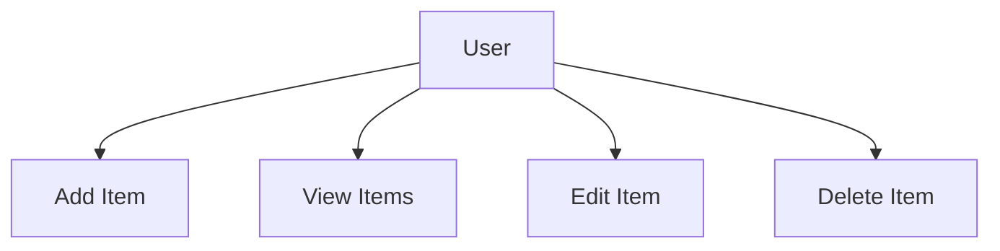
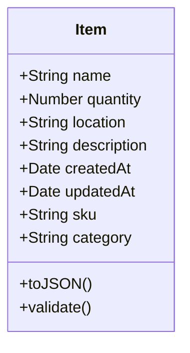
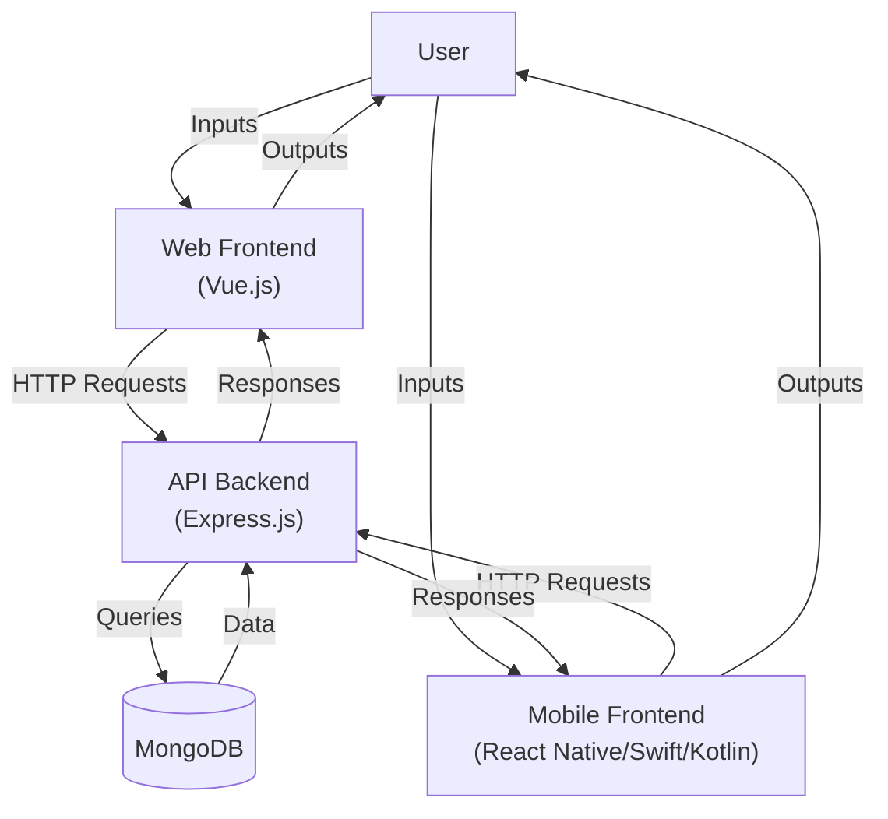

# Inventory App Design Document
- **Author**: Ryan A. Snell
- **Date**: 29 May 2025
- **Version**: 1.0

## Introduction

The Inventory App is a cross-platform application designed as a reusable template for managing inventories across domains such as warehouses, retail stores, and personal collections. It offers a user-friendly interface for adding, viewing, editing, and deleting inventory items, with support for both web and mobile platforms. Built with a modern tech stack, the app ensures scalability, maintainability, and extensibility. This document provides a comprehensive overview of the system architecture, data models, API design, frontend designs for web (Vue.js) and mobile (React Native, Swift for iOS, Kotlin for Android), backend (Express.js, MongoDB), a data flow diagram, and detailed enhancement suggestions to improve functionality, usability, and scalability.

### Goals
- Deliver a modular, reusable inventory management solution.
- Support web (Vue.js) and mobile clients (React Native, with native Swift for iOS and Kotlin for Android).
- Provide a robust backend using Express.js and MongoDB.
- Enable extensibility for future features, such as categories and user authentication.

### Project Context
- **Date**: May 26, 2025 (Sprint 2 completed, Day 28 of 181 project days).
- **Styling Update**: The web frontend has transitioned from TailwindCSS to custom PostCSS styles (post-Sprint 2).
- **Navigation Update**: The web frontend uses a single route (`/`) with modals for Add/Edit/View actions, not separate routes as initially planned.

### Notes
This document is divided into parts for clarity:
- **Part 1**: System Architecture Overview
- **Part 2**: Use Cases
- **Part 3**: Data Model
- **Part 4**: Sequence Diagrams
- **Part 5**: API Design
- **Part 6**: MongoDB Schema
- **Part 7**: Component Structure
- **Part 8**: Navigation Flow
- **Part 9**: Data Flow Diagram
- **Part 10**: Enhancement Suggestions
- **Part 11**: Deployment and Future Considerations

# Inventory App Design Document - Part 1: System Architecture Overview

## 1. System Architecture Overview

### Overview
The Inventory App follows a client-server architecture with a RESTful API, enabling web and mobile clients to interact with a centralized backend. Shared logic ensures consistency across platforms, facilitating seamless data management and synchronization.

### Architecture Diagram
```plaintext
+------------------+     HTTP     +-------------+     Mongoose    +-------------+
| Vue.js Web       |  <------->   |  Express.js |  <----------->  |  MongoDB    |
| React Native     |              |    API      |                 |             |
| Swift (iOS)      |              |             |                 |             |
| Kotlin (Android) |              |             |                 |             |
+------------------+              +-------------+                 +-------------+
        ^                               ^                                 
        | Axios                         | CORS, JSON                     
        |                               |
        +-------- Shared Logic ---------+
                (e.g., shared/api.js)
```

### Key Components
- **Web Frontend (Vue.js)**: A single-page application (SPA) using Vue Router and custom PostCSS styles for responsive design.
- **Mobile Frontend (React Native)**: A cross-platform mobile app for iOS and Android, using React Navigation for screen transitions.
- **Native Mobile (Swift for iOS)**: A native iOS app using SwiftUI, leveraging Apple’s ecosystem for performance and integration.
- **Native Mobile (Kotlin for Android)**: A native Android app using Jetpack Compose, incorporating modern Android features like Material Design.
- **Backend (Express.js API)**: A Node.js backend handling CRUD operations, with middleware for CORS, JSON parsing, and error handling.
- **Database (MongoDB)**: A NoSQL database accessed via Mongoose for schema validation and efficient querying.
- **Shared Logic (shared/api.js)**: A unified API client using Axios (for web and React Native), Retrofit (Kotlin), and URLSession (Swift) to ensure consistent API interactions across platforms.

### Scalability Considerations
- **Horizontal Scaling**: Deploy the Express.js API across multiple instances behind a load balancer to handle increased traffic.
- **Database Sharding**: Use MongoDB sharding to manage large datasets effectively.
- **Caching**: Integrate Redis to cache frequently accessed data, reducing database load.

### Notes
- The shared logic (`shared/api.js`) ensures consistency in API calls across platforms, reducing code duplication.
- Scalability features like Redis caching are detailed in the **Performance Optimization** enhancement (Part 10, Section 10.9).

# Inventory App Design Document - Part 2: Use Cases

## 2. Use Cases

### Overview
This section identifies the primary use cases for the Inventory App, focusing on the **User** (e.g., inventory manager, shop owner) as the main actor. It outlines core interactions and previews future use cases for expansion.

### Use Case Diagram


### Core Use Cases
- **Add Item**: Create a new inventory item with details such as name, quantity, location, and description.
- **View Items**: Retrieve and display a list of all items or view a single item’s details.
- **Edit Item**: Update the details of an existing item.
- **Delete Item**: Remove an item from the inventory.

### Future Use Cases
- **Search Items**: Filter or search items by attributes like name, location, or category.
- **Categorize Items**: Group items by categories or tags for better organization.
- **User Authentication**: Restrict access to authorized users with role-based permissions.
- **Cross-Platform Sync**: Synchronize data across iOS (Swift) and Android (Kotlin) apps in real time.

### Summary
These use cases form the foundation of the app’s functionality, with detailed flows provided in the **Sequence Diagrams** (Part 4). Future use cases will be addressed in the **Enhancement Suggestions** (Part 10).

# Inventory App Design Document - Part 3: Data Model

## 3. Data Model

### Overview
The core data model for the Inventory App is the `Item`, representing an individual inventory entry. This section defines the `Item` model’s attributes, methods, and schema used in MongoDB.

### Class Diagram


### Item Model Details
- **Attributes**:
    - `name: String` (required, e.g., "Laptop"): The name of the item.
    - `quantity: Number` (required, e.g., 10): The stock quantity, must be >= 0.
    - `location: String` (optional, e.g., "Warehouse A"): The storage location.
    - `description: String` (optional, e.g., "Dell XPS 13"): Additional item details.
    - `createdAt: Date` (auto-generated): Timestamp of item creation.
    - `updatedAt: Date` (auto-generated): Timestamp of last update.
    - `sku: String` (optional, unique, e.g., "LAP123"): Stock Keeping Unit for barcode/QR code integration.
    - `category: String` (optional, e.g., "Electronics"): Category for grouping items.

- **Methods**:
    - `toJSON()`: Serializes item data for API responses, ensuring virtual fields are included.
    - `validate()`: Ensures required fields (`name`, `quantity`) meet constraints (e.g., `quantity` >= 0).

### MongoDB Schema (Mongoose)
The `Item` model is implemented in MongoDB using Mongoose for schema validation and indexing. This is further detailed in **Part 6: MongoDB Schema**.

### Notes
- The `Item` model supports extensibility for future features like categories and translations (see **Enhancement Suggestions**, Part 10).
- The MongoDB schema is referenced in the **API Design** (Part 5) for request/response formats.

# Inventory App Design Document - Part 4: Sequence Diagrams

## 4. Sequence Diagrams

### Overview
This section provides sequence diagrams for the core use cases, detailing the interactions between the User, Web/Mobile App, Express.js API, and MongoDB. These diagrams illustrate the flow of data for each operation.

### Add Item
```plaintext
User -> Web/Mobile App: Click "Add Item"
Web/Mobile App -> Express API: POST /api/items {name, quantity, location, description}
Express API -> MongoDB: Save Item
MongoDB -> Express API: Item Saved
Express API -> Web/Mobile App: 201 Created + Item
Web/Mobile App -> User: Display Success Message
```

### View Items
```plaintext
User -> Web/Mobile App: Navigate to HomePage
Web/Mobile App -> Express API: GET /api/items
Express API -> MongoDB: Item.find()
MongoDB -> Express API: List of Items
Express API -> Web/Mobile App: 200 OK + [Item]
Web/Mobile App -> User: Render Item List
```

### Edit Item
```plaintext
User -> Web/Mobile App: Click "Edit" on Item
Web/Mobile App -> Express API: GET /api/items/:id
Express API -> MongoDB: Item.findById()
MongoDB -> Express API: Item
Express API -> Web/Mobile App: 200 OK + Item
Web/Mobile App -> User: Display Edit Form
User -> Web/Mobile App: Submit Updated Data
Web/Mobile App -> Express API: PUT /api/items/:id {name?, quantity?, location?, description?}
Express API -> MongoDB: Item.findByIdAndUpdate()
MongoDB -> Express API: Updated Item
Express API -> Web/Mobile App: 200 OK + Item
Web/Mobile App -> User: Display Success Message
```

### Delete Item
```plaintext
User -> Web/Mobile App: Click "Delete" on Item
Web/Mobile App -> Express API: DELETE /api/items/:id
Express API -> MongoDB: Item.findByIdAndDelete()
MongoDB -> Express API: Deletion Confirmed
Express API -> Web/Mobile App: 204 No Content
Web/Mobile App -> User: Display Success Message
```

### Notes
- The API endpoint has been updated to `/api/items` to reflect the project’s current implementation.
- These flows are complemented by the **Data Flow Diagram** (Part 9) for a broader system perspective.

# Inventory App Design Document - Part 5: API Design

## 5. API Design

### Overview
This section documents the RESTful API endpoints for the Inventory App, providing a clear interface for web and mobile clients to interact with the backend. The API is designed to support CRUD operations on inventory items.

### Base URL: `/api/items`

| Method | Endpoint   | Description     | Request Body                                    | Response Body | Status Codes       |
|--------|------------|-----------------|-------------------------------------------------|---------------|--------------------|
| GET    | `/`        | List all items  | N/A                                             | `[Item]`      | 200, 500           |
| GET    | `/:id`     | Get item by ID  | N/A                                             | `Item`        | 200, 404, 500      |
| POST   | `/`        | Create new item | `{ name, quantity, location?, description? }`   | `Item`        | 201, 400, 500      |
| PUT    | `/:id`     | Update an item  | `{ name?, quantity?, location?, description? }` | `Item`        | 200, 400, 404, 500 |
| DELETE | `/:id`     | Delete an item  | N/A                                             | N/A           | 204, 404, 500      |

### Example Requests and Responses

#### GET /api/items
- **Request**: `GET /api/items`
- **Response** (200):
  ```json
  [
    {
      "_id": "12345",
      "name": "Laptop",
      "quantity": 10,
      "location": "Warehouse A",
      "description": "Dell XPS 13",
      "createdAt": "2025-05-22T15:00:00Z",
      "updatedAt": "2025-05-22T15:00:00Z"
    }
  ]
  ```

#### POST /api/items
- **Request**:
  ```json
  {
    "name": "Mouse",
    "quantity": 50,
    "location": "Shelf B",
    "description": "Wireless Logitech"
  }
  ```
- **Response** (201):
  ```json
  {
    "_id": "67890",
    "name": "Mouse",
    "quantity": 50,
    "location": "Shelf B",
    "description": "Wireless Logitech",
    "createdAt": "2025-05-22T15:01:00Z",
    "updatedAt": "2025-05-22T15:01:00Z"
  }
  ```

#### Error Response (400)
- **Response**:
  ```json
  {
    "error": "Name and quantity are required"
  }
  ```

### Notes
- The base URL has been updated to `/api/items` to align with the project’s current implementation.
- Additional endpoints (e.g., `/api/auth`, `/api/sync`) are introduced in the **Enhancement Suggestions** (Part 10).

# Inventory App Design Document - Part 6: MongoDB Schema

## 6. MongoDB Schema (Mongoose)

### Overview
This section defines the MongoDB schema for the `Item` model using Mongoose, including field definitions, validation rules, indexing, and timestamps.

### Schema Definition
```javascript
const mongoose = require('mongoose');

const itemSchema = new mongoose.Schema({
  name: { type: String, required: true, trim: true },
  quantity: { type: Number, required: true, min: 0 },
  location: { type: String, trim: true },
  description: { type: String, trim: true },
  sku: { type: String, unique: true, sparse: true },
  category: { type: String, trim: true }
}, {
  timestamps: true,
  toJSON: { virtuals: true }
});

itemSchema.index({ name: 'text', location: 'text' });

module.exports = mongoose.model('Item', itemSchema);
```

### Details
- **Validation**: Ensures `name` and `quantity` are required, with `quantity` >= 0.
- **Indexing**: Text indexes on `name` and `location` enable efficient search queries.
- **Sparse Index**: Allows `sku` to be unique but optional (for barcode/QR code support).
- **Timestamps**: Automatically adds `createdAt` and `updatedAt` fields.

### Notes
- The schema aligns with the `Item` model defined in **Part 3: Data Model**.
- Future enhancements (e.g., internationalization) may extend this schema (see **Enhancement Suggestions**, Part 10, Section 10.7).

# Inventory App Design Document - Part 7: Component Structure

## 7. Component Structure

### Overview
This section outlines the component hierarchy for the web (Vue.js), React Native, Swift (iOS), and Kotlin (Android) frontends, detailing the structure and purpose of each component.

### Web (Vue.js)
```plaintext
App.vue
├── Header.vue
├── HomePage.vue
│   ├── ItemList.vue
│   │   └── ItemCard.vue
│   ├── AddItemModal.vue
│   ├── EditItemModal.vue
│   ├── ViewItemModal.vue
└── Footer.vue
```

- **App.vue**: Root component with the main layout (header, main content, footer).
- **Header.vue**: Navigation bar with the app title and an "Add Item" button.
- **HomePage.vue**: Displays the item list and manages modals for Add/Edit/View actions.
- **ItemList.vue**: Renders a list of items using `ItemCard.vue`.
- **ItemCard.vue**: Displays individual item details with View/Edit/Delete buttons.
- **AddItemModal.vue**: Modal for adding new items.
- **EditItemModal.vue**: Modal for editing existing items.
- **ViewItemModal.vue**: Modal for viewing item details (read-only).
- **Footer.vue**: Static footer with version information.

### Mobile (React Native)
```plaintext
App.js
├── HomePage.js
│   ├── ItemList.js
│   │   └── ItemCard.js
├── AddItem.js
├── EditItem.js
└── ViewItem.js
```

- **App.js**: Root component with navigation setup (React Navigation).
- **HomePage.js**: Default screen displaying the item list.
- **ItemList.js**: Renders a list of items using `ItemCard.js`.
- **ItemCard.js**: Displays individual item details with View/Edit/Delete buttons.
- **AddItem.js**: Screen for adding new items.
- **EditItem.js**: Screen for editing existing items.
- **ViewItem.js**: Screen for viewing item details (read-only).

### Mobile (Swift, iOS)
```plaintext
App.swift
├── HomeView.swift
│   ├── ItemListView.swift
│   │   └── ItemCardView.swift
├── AddItemView.swift
├── EditItemView.swift
└── ViewItemView.swift
```

- **App.swift**: Root entry point with navigation setup (NavigationStack).
- **HomeView.swift**: Main view displaying the item list.
- **ItemListView.swift**: Renders a list of items using `ItemCardView.swift`.
- **ItemCardView.swift**: Displays individual item details with View/Edit/Delete actions.
- **AddItemView.swift**: View for adding new items.
- **EditItemView.swift**: View for editing existing items.
- **ViewItemView.swift**: View for viewing item details (read-only).

### Mobile (Kotlin, Android)
```plaintext
MainActivity.kt
├── HomeScreen.kt
│   ├── ItemListScreen.kt
│   │   └── ItemCard.kt
├── AddItemScreen.kt
├── EditItemScreen.kt
└── ViewItemScreen.kt
```

- **MainActivity.kt**: Root entry point with navigation setup (NavHost).
- **HomeScreen.kt**: Main screen displaying the item list.
- **ItemListScreen.kt**: Renders a list of items using `ItemCard.kt`.
- **ItemCard.kt**: Displays individual item details with View/Edit/Delete actions.
- **AddItemScreen.kt**: Screen for adding new items.
- **EditItemScreen.kt**: Screen for editing existing items.
- **ViewItemScreen.kt**: Screen for viewing item details (read-only).

### Notes
- The web frontend uses modals for Add/Edit/View actions, reflecting the current single-route (`/`) approach.
- Component names and structures are consistent across platforms, with platform-specific adaptations (e.g., modals for web, screens for mobile).

# Inventory App Design Document - Part 8: Navigation Flow

## 8. Navigation Flow

### Overview
This section details the navigation structure for the web (Vue.js) and mobile (React Native, SwiftUI, Jetpack Compose) platforms, outlining how users move between views or screens.

### Web (Vue Router)
- **Single Route with Modals**:
    - `/`: `HomePage.vue` (displays item list, with modals for Add/Edit/View actions).
    - **Add Item**: Opens `AddItemModal.vue` within `HomePage.vue`.
    - **Edit Item**: Opens `EditItemModal.vue` within `HomePage.vue`.
    - **View Item**: Opens `ViewItemModal.vue` within `HomePage.vue`.

### Mobile (React Navigation)
- **Stack Navigator**:
    - `HomePage`: Default screen with the item list.
    - `AddItem`: Screen for creating a new item.
    - `EditItem`: Screen for editing an item.
    - `ViewItem`: Screen for viewing item details.

### Mobile (SwiftUI, iOS)
- **NavigationStack**:
    - `HomeView`: Displays the item list.
    - `AddItemView`: View for creating a new item.
    - `EditItemView`: View for editing an item.
    - `ViewItemView`: View for viewing item details.

### Mobile (Jetpack Compose, Android)
- **NavHost**:
  ```kotlin
  @Composable
  fun AppNavigation() {
      val navController = rememberNavController()
      NavHost(navController, startDestination = "home") {
          composable("home") { HomeScreen(navController) }
          composable("add") { AddItemScreen(navController) }
          composable("edit/{id}") { backStackEntry ->
              EditItemScreen(navController, backStackEntry.arguments?.getString("id") ?: "")
          }
          composable("view/{id}") { backStackEntry ->
              ViewItemScreen(navController, backStackEntry.arguments?.getString("id") ?: "")
          }
      }
  }
  ```

### Notes
- The web navigation has been updated to use modals within a single route (`/`), aligning with the project’s current implementation.
- Mobile platforms use screen-based navigation for a native feel, consistent with platform conventions.

# Inventory App Design Document - Part 9: Data Flow Diagram

## 9. Data Flow Diagram

### Overview
The Data Flow Diagram (DFD) illustrates how data moves through the Inventory App system, from user interactions to database storage and back. It covers the web frontend (Vue.js), mobile frontend (React Native, Swift for iOS, Kotlin for Android), API backend (Express.js), and MongoDB database.

### Level-0 DFD (Context Diagram)
- **External Entity**: User
- **Process**: Inventory App System
- **Data Store**: MongoDB
- **Data Flows**:
    - **User Inputs**: Commands such as adding, viewing, editing, or deleting items.
    - **User Outputs**: Visual outputs like item lists, success messages, or error alerts.
    - **Item Data**: Read/write operations between the system and MongoDB.

### Level-1 DFD
- **External Entity**: User
- **Processes**:
    - **P1: Web Frontend (Vue.js)**: Handles user inputs via the browser and renders the UI.
    - **P2: Mobile Frontend (React Native/Swift iOS/Kotlin Android)**: Manages mobile inputs and displays screens.
    - **P3: API Backend (Express.js)**: Processes requests and interacts with the database.
- **Data Store**: **D1: MongoDB**: Stores item data.
- **Data Flows**:
    - User -> P1: Web inputs (e.g., form submissions, clicks).
    - User -> P2: Mobile inputs (e.g., taps, form data).
    - P1 -> P3: HTTP requests (e.g., POST /api/items, GET /api/items).
    - P2 -> P3: HTTP requests via Axios (React Native), URLSession (Swift), Retrofit (Kotlin).
    - P3 <-> D1: MongoDB queries (e.g., Item.find(), Item.save()).
    - P3 -> P1: HTTP responses (e.g., JSON item data).
    - P3 -> P2: HTTP responses.
    - P1 -> User: Rendered UI (e.g., item list, modals).
    - P2 -> User: Mobile screens (e.g., item list, forms).

### Visual Representation


### Notes
- This DFD provides a high-level view of data movement, complementing the **Sequence Diagrams** (Part 4) for specific use cases.
- Future enhancements like offline support (Part 10, Section 10.3) will extend the DFD with local storage flows.

# Inventory App Design Document - Part 10.1: Enhanced User Authentication and Authorization

## 10.1 Enhanced User Authentication and Authorization

### Overview
Implement JWT-based authentication with Role-Based Access Control (RBAC) to enhance security and support multi-user collaboration.

### Why
Authentication restricts access to authorized users, and RBAC enables role-specific permissions (e.g., Admins can delete items, Viewers can only read), which is essential for collaborative environments like warehouse teams.

### Implementation
- **Backend (Express.js)**:
  - Add `User` model:
    ```javascript
    const mongoose = require('mongoose');
    const bcrypt = require('bcrypt');
    const userSchema = new mongoose.Schema({
      username: { type: String, required: true, unique: true },
      password: { type: String, required: true },
      role: { type: String, enum: ['admin', 'manager', 'viewer'], default: 'viewer' }
    });
    userSchema.pre('save', async function(next) {
      if (this.isModified('password')) {
        this.password = await bcrypt.hash(this.password, 10);
      }
      next();
    });
    module.exports = mongoose.model('User', userSchema);
    ```
  - Create `/api/auth` endpoints:
    ```javascript
    const express = require('express');
    const jwt = require('jsonwebtoken');
    const bcrypt = require('bcrypt');
    const router = express.Router();
    const User = require('../models/User');
    router.post('/register', async (req, res, next) => {
      try {
        const user = new User(req.body);
        await user.save();
        res.status(201).json({ message: 'User created' });
      } catch (err) { next(err); }
    });
    router.post('/login', async (req, res, next) => {
      try {
        const { username, password } = req.body;
        const user = await User.findOne({ username });
        if (!user || !await bcrypt.compare(password, user.password)) {
          return res.status(401).json({ error: 'Invalid credentials' });
        }
        const token = jwt.sign({ id: user._id, role: user.role }, 'secret', { expiresIn: '1h' });
        res.json({ token });
      } catch (err) { next(err); }
    });
    module.exports = router;
    ```
  - Protect routes:
    ```javascript
    const jwt = require('jsonwebtoken');
    const auth = (roles = []) => (req, res, next) => {
      const token = req.headers.authorization?.split(' ')[1];
      if (!token) return res.status(401).json({ error: 'No token provided' });
      try {
        const decoded = jwt.verify(token, 'secret');
        if (roles.length && !roles.includes(decoded.role)) {
          return res.status(403).json({ error: 'Insufficient permissions' });
        }
        req.user = decoded;
        next();
      } catch (err) {
        res.status(401).json({ error: 'Invalid token' });
      }
    };
    router.delete('/:id', auth(['admin']), async (req, res, next) => { /* Deletion logic */ });
    ```

- **Web (Vue.js)**:
  - Add `Login.vue`:
    ```vue
    <template>
      <div class="modal">
        <form @submit.prevent="login">
          <input v-model="username" placeholder="Username" required />
          <input v-model="password" type="password" placeholder="Password" required />
          <button type="submit">Login</button>
        </form>
      </div>
    </template>
    <script>
    import { getItems } from '@/shared/api';
    export default {
      data: () => ({ username: '', password: '' }),
      methods: {
        async login() {
          try {
            const { token } = await this.$api.post('/auth/login', {
              username: this.username,
              password: this.password
            });
            localStorage.setItem('token', token);
            this.$router.push('/');
          } catch (err) {
            alert('Login failed');
          }
        }
      }
    };
    </script>
    ```
  - Update `shared/api.js`:
    ```javascript
    import axios from 'axios';
    const api = axios.create({
      baseURL: 'http://localhost:5055/api',
      headers: { 'Content-Type': 'application/json' }
    });
    api.interceptors.request.use(config => {
      const token = localStorage.getItem('token');
      if (token) config.headers.Authorization = `Bearer ${token}`;
      return config;
    });
    export const getItems = async (params = {}) => {
      try {
        const { data } = await api.get('/items', { params });
        return data;
      } catch (err) {
        throw new Error(err.response?.data?.error || 'Failed to fetch items');
      }
    };
    export const getItem = async (id) => {
      try {
        const { data } = await api.get(`/items/${id}`);
        return data;
      } catch (err) {
        throw new Error(err.response?.data?.error || 'Failed to fetch item');
      }
    };
    export const createItem = async (data) => {
      try {
        const { data: newItem } = await api.post('/items', data);
        return newItem;
      } catch (err) {
        throw new Error(err.response?.data?.error || 'Failed to create item');
      }
    };
    export const updateItem = async (id, data) => {
      try {
        const { data: updatedItem } = await api.put(`/items/${id}`, data);
        return updatedItem;
      } catch (err) {
        throw new Error(err.response?.data?.error || 'Failed to update item');
      }
    };
    export const deleteItem = async (id) => {
      try {
        await api.delete(`/items/${id}`);
      } catch (err) {
        throw new Error(err.response?.data?.error || 'Failed to delete item');
      }
    };
    ```

- **Mobile (React Native)**:
  - Add `Login.js`:
    ```javascript
    import AsyncStorage from '@react-native-async-storage/async-storage';
    import { useNavigation } from '@react-navigation/native';
    import { useState } from 'react';
    import { View, TextInput, Button } from 'react-native';
    import { getItems } from '../shared/api';

    export default function Login() {
      const [username, setUsername] = useState('');
      const [password, setPassword] = useState('');
      const navigation = useNavigation();
      const login = async () => {
        try {
          const { token } = await getItems('/auth/login', { method: 'POST', data: { username, password } });
          await AsyncStorage.setItem('token', token);
          navigation.navigate('HomePage');
        } catch (err) {
          alert('Login failed');
        }
      };
      return (
        <View>
          <TextInput value={username} onChangeText={setUsername} placeholder="Username" />
          <TextInput value={password} onChangeText={setPassword} placeholder="Password" secureTextEntry />
          <Button title="Login" onPress={login} />
        </View>
      );
    }
    ```

- **Mobile (Swift, iOS)**:
  - Add `LoginView.swift`:
    ```swift
    struct LoginView: View {
        @State private var username = ""
        @State private var password = ""
        @EnvironmentObject var auth: AuthViewModel
        var body: some View {
            VStack {
                TextField("Username", text: $username)
                SecureField("Password", text: $password)
                Button("Login") {
                    Task { await auth.login(username: username, password: password) }
                }
            }
        }
    }
    class AuthViewModel: ObservableObject {
        func login(username: String, password: String) async {
            do {
                let response = try await URLSession.shared.data(for: URLRequest(url: URL(string: "http://localhost:5055/api/auth/login")!))
                let token = // Parse JSON
                try await KeychainWrapper.standard.set(token, forKey: "authToken")
            } catch { /* Show error */ }
        }
    }
    ```

- **Mobile (Kotlin, Android)**:
  - Add `LoginScreen.kt`:
    ```kotlin
    @Composable
    fun LoginScreen(navController: NavController, viewModel: AuthViewModel = viewModel()) {
        var username by remember { mutableStateOf("") }
        var password by remember { mutableStateOf("") }
        Column {
            TextField(value = username, onValueChange = { username = it }, label = { Text("Username") })
            TextField(value = password, onValueChange = { password = it }, label = { Text("Password") }, visualTransformation = PasswordVisualTransformation())
            Button(onClick = { viewModel.login(username, password) { navController.navigate("home") } }) {
                Text("Login")
            }
        }
    }
    class AuthViewModel : ViewModel() {
        fun login(username: String, password: String, onSuccess: () -> Unit) {
            viewModelScope.launch {
                try {
                    val response = api.login(LoginRequest(username, password))
                    // Save token to SharedPreferences
                    onSuccess()
                } catch (e: Exception) {
                    // Show error
                }
            }
        }
    }
    ```

### Impact
- Enhances security by restricting access to authorized users.
- Supports enterprise use with role-based collaboration.

### Related Considerations
- **Rate Limiting**: Prevent brute-force attacks (see **Deployment and Future Considerations**, Part 11).
- **Internationalization**: Store user language preferences (Part 10, Section 10.7).

# Inventory App Design Document - Part 10.2: Advanced Search and Filtering

## 10.2 Advanced Search and Filtering

### Overview
Add advanced search and filtering capabilities to improve usability for large inventories.

### Why
Efficient searching by attributes like name, category, or quantity enhances productivity, especially in large-scale inventory settings.

### Implementation
- **Backend (Express.js)**:
  - Extend `GET /api/items`:
    ```javascript
    router.get('/', async (req, res, next) => {
      try {
        const { name, category, quantity, sort } = req.query;
        const query = {};
        if (name) query.name = { $regex: name, $options: 'i' };
        if (category) query.category = category;
        if (quantity) query.quantity = { $gte: parseInt(quantity) };
        const items = await Item.find(query).sort(sort || '-createdAt');
        res.json(items);
      } catch (err) { next(err); }
    });
    ```

- **Web (Vue.js)**:
  - Update `HomePage.vue` with search UI:
    ```vue
    <template>
      <div class="container content-padding">
        <h2 class="section-title">Inventory Items</h2>
        <div class="search-filter">
          <input
            v-model="searchQuery"
            placeholder="Search items..."
            class="form-input"
            @input="debounceSearch"
          />
          <select v-model="categoryFilter" class="form-input" @change="debounceSearch">
            <option value="">All Categories</option>
            <option value="electronics">Electronics</option>
          </select>
          <input type="number" v-model="quantityFilter" placeholder="Min Quantity" class="form-input" @input="debounceSearch" />
        </div>
        <div class="refresh-section">
          <button @click="fetchItems" class="btn btn-secondary">Refresh</button>
        </div>
        <div v-if="loading" class="text-center">Loading...</div>
        <div v-else-if="error" class="error-text text-center">{{ error }}</div>
        <div v-else-if="!filteredItems.length" class="empty-text text-center">
          No items found. Click "Add Item" to get started!
        </div>
        <div v-else>
          <div v-for="item in filteredItems" :key="item._id">
            <ItemCard
              :item="item"
              @view="openViewModal(item)"
              @edit="openEditModal(item)"
              @delete="deleteItem(item._id)"
            />
          </div>
        </div>
        <AddItemModal
          :is-open="showAddModal"
          @close="$emit('close-add-modal')"
          @refresh="fetchItems"
        />
        <EditItemModal
          :is-open="showEditModal"
          :item="selectedItem"
          @close="showEditModal = false"
          @refresh="fetchItems"
        />
        <ViewItemModal
          :is-open="showViewModal"
          :item="selectedItem"
          @close="showViewModal = false"
        />
      </div>
    </template>
    <script>
    import { debounce } from 'lodash';
    import ItemCard from './ItemCard.vue';
    import AddItemModal from './AddItemModal.vue';
    import EditItemModal from './EditItemModal.vue';
    import ViewItemModal from './ViewItemModal.vue';
    import { getItems, deleteItem } from '@/shared/api';

    export default {
      components: { ItemCard, AddItemModal, EditItemModal, ViewItemModal },
      props: {
        showAddModal: {
          type: Boolean,
          default: false
        }
      },
      emits: ['close-add-modal'],
      data() {
        return {
          searchQuery: '',
          categoryFilter: '',
          quantityFilter: '',
          items: [],
          filteredItems: [],
          loading: false,
          error: null,
          showEditModal: false,
          showViewModal: false,
          selectedItem: null
        };
      },
      created() {
        this.debounceSearch = debounce(this.fetchItems, 300);
        this.fetchItems();
      },
      methods: {
        async fetchItems() {
          this.loading = true;
          this.error = null;
          try {
            const params = new URLSearchParams({
              name: this.searchQuery,
              category: this.categoryFilter,
              quantity: this.quantityFilter
            }).toString();
            this.items = await getItems(params ? `?${params}` : '');
            this.filteredItems = this.items;
          } catch (err) {
            this.error = err.message;
          } finally {
            this.loading = false;
          }
        },
        async deleteItem(id) {
          if (confirm('Are you sure you want to delete this item?')) {
            try {
              await deleteItem(id);
              this.fetchItems();
            } catch (err) {
              alert(err.message);
            }
          }
        },
        openEditModal(item) {
          this.selectedItem = item;
          this.showEditModal = true;
        },
        openViewModal(item) {
          this.selectedItem = item;
          this.showViewModal = true;
        }
      }
    };
    </script>
    <style scoped>
    .content-padding {
      padding: 1rem;
    }
    .section-title {
      font-size: 1.25rem;
      margin-bottom: 1rem;
    }
    .search-filter {
      display: flex;
      gap: 1rem;
      margin-bottom: 1rem;
    }
    .refresh-section {
      margin-bottom: 1rem;
    }
    .text-center {
      text-align: center;
    }
    .error-text {
      color: #ef4444;
    }
    .empty-text {
      color: #6b7280;
    }
    </style>
    ```

- **Mobile (React Native)**:
  - Update `HomePage.js` with search UI:
    ```javascript
    import { useState, useEffect } from 'react';
    import { TextInput, Picker, FlatList, View, Text, Button, StyleSheet } from 'react-native';
    import { debounce } from 'lodash';
    import { getItems, deleteItem } from '@/shared/api';

    export default function HomePage({ navigation }) {
      const [searchQuery, setSearchQuery] = useState('');
      const [categoryFilter, setCategoryFilter] = useState('');
      const [quantityFilter, setQuantityFilter] = useState('');
      const [items, setItems] = useState([]);
      const [loading, setLoading] = useState(false);
      const [error, setError] = useState(null);

      const fetchItems = debounce(async () => {
        setLoading(true);
        setError(null);
        try {
          const params = new URLSearchParams({
            name: searchQuery,
            category: categoryFilter,
            quantity: quantityFilter
          }).toString();
          const data = await getItems(params ? `?${params}` : '');
          setItems(data);
        } catch (err) {
          setError(err.message);
        } finally {
          setLoading(false);
        }
      }, 300);

      useEffect(() => {
        fetchItems();
      }, [searchQuery, categoryFilter, quantityFilter]);

      const handleDelete = async (id) => {
        if (confirm('Are you sure you want to delete this item?')) {
          try {
            await deleteItem(id);
            fetchItems();
          } catch (err) {
            alert(err.message);
          }
        }
      };

      return (
        <View style={styles.container}>
          <Text style={styles.title}>Inventory Items</Text>
          <TextInput
            style={styles.input}
            value={searchQuery}
            onChangeText={setSearchQuery}
            placeholder="Search items..."
          />
          <Picker
            style={styles.input}
            selectedValue={categoryFilter}
            onValueChange={setCategoryFilter}
          >
            <Picker.Item label="All Categories" value="" />
            <Picker.Item label="Electronics" value="electronics" />
          </Picker>
          <TextInput
            style={styles.input}
            value={quantityFilter}
            onChangeText={setQuantityFilter}
            placeholder="Min Quantity"
            keyboardType="numeric"
          />
          <Button title="Refresh" onPress={fetchItems} />
          {loading && <Text style={styles.textCenter}>Loading...</Text>}
          {error && <Text style={[styles.textCenter, styles.errorText]}>{error}</Text>}
          {!loading && !error && items.length === 0 && (
            <Text style={[styles.textCenter, styles.emptyText]}>No items found. Add an item to get started!</Text>
          )}
          {!loading && !error && items.length > 0 && (
            <FlatList
              data={items}
              keyExtractor={(item) => item._id}
              renderItem={({ item }) => (
                <View style={styles.card}>
                  <Text style={styles.cardTitle}>{item.name}</Text>
                  <Text style={styles.cardText}>Quantity: {item.quantity}</Text>
                  <Text style={styles.cardText}>Location: {item.location || 'N/A'}</Text>
                  <Text style={styles.cardText}>Description: {item.description || 'N/A'}</Text>
                  <View style={styles.cardActions}>
                    <Button title="View" onPress={() => navigation.navigate('ViewItem', { item })} />
                    <Button title="Edit" onPress={() => navigation.navigate('EditItem', { item })} />
                    <Button title="Delete" color="#ef4444" onPress={() => handleDelete(item._id)} />
                  </View>
                </View>
              )}
            />
          )}
          <Button title="Add Item" onPress={() => navigation.navigate('AddItem')} />
        </View>
      );
    }

    const styles = StyleSheet.create({
      container: { padding: 16, flex: 1 },
      title: { fontSize: 20, marginBottom: 16 },
      input: {
        borderWidth: 1,
        borderColor: '#d1d5db',
        padding: 8,
        borderRadius: 4,
        marginBottom: 16
      },
      textCenter: { textAlign: 'center', marginVertical: 8 },
      errorText: { color: '#ef4444' },
      emptyText: { color: '#6b7280' },
      card: {
        borderWidth: 1,
        borderColor: '#e5e7eb',
        padding: 16,
        marginBottom: 8,
        borderRadius: 4,
        backgroundColor: 'white',
        shadowColor: '#000',
        shadowOffset: { width: 0, height: 1 },
        shadowOpacity: 0.1,
        shadowRadius: 3
      },
      cardTitle: { fontSize: 18, fontWeight: '600', color: '#1f2937' },
      cardText: { color: '#6b7280' },
      cardActions: { flexDirection: 'row', justifyContent: 'space-between', marginTop: 8 }
    });
    ```

- **Mobile (Swift, iOS)**:
  - Update `HomeView.swift` with search UI:
    ```swift
    struct HomeView: View {
        @StateObject private var viewModel = InventoryViewModel()
        @State private var searchQuery = ""
        @State private var categoryFilter = ""
        @State private var quantityFilter = ""
        var body: some View {
            NavigationStack {
                VStack {
                    TextField("Search items...", text: $searchQuery)
                        .onChange(of: searchQuery) { _ in viewModel.fetchItems() }
                    Picker("Category", selection: $categoryFilter) {
                        Text("All Categories").tag("")
                        Text("Electronics").tag("electronics")
                    }
                    TextField("Min Quantity", text: $quantityFilter)
                        .keyboardType(.numberPad)
                        .onChange(of: quantityFilter) { _ in viewModel.fetchItems() }
                    ItemListView(items: viewModel.items)
                }
            }
        }
    }
    class InventoryViewModel: ObservableObject {
        @Published var items: [Item] = []
        private var searchQuery = ""
        private var categoryFilter = ""
        private var quantityFilter = ""
        func fetchItems() {
            Task {
                let params = ["name": searchQuery, "category": categoryFilter, "quantity": quantityFilter]
                    .compactMap { k, v in v.isEmpty ? nil : "\(k)=\(v)" }
                    .joined(separator: "&")
                let url = URL(string: "http://localhost:5055/api/items?\(params)")!
                let (data, _) = try await URLSession.shared.data(from: url)
                self.items = try JSONDecoder().decode([Item].self, from: data)
            }
        }
    }
    ```

- **Mobile (Kotlin, Android)**:
  - Update `HomeScreen.kt` with search UI:
    ```kotlin
    @Composable
    fun HomeScreen(navController: NavController, viewModel: InventoryViewModel = viewModel()) {
        var searchQuery by remember { mutableStateOf("") }
        var categoryFilter by remember { mutableStateOf("") }
        var quantityFilter by remember { mutableStateOf("") }
        LaunchedEffect(searchQuery, categoryFilter, quantityFilter) {
            viewModel.fetchItems(searchQuery, categoryFilter, quantityFilter)
        }
        Column {
            TextField(value = searchQuery, onValueChange = { searchQuery = it }, label = { Text("Search items...") })
            Spinner(items = listOf("", "electronics"), selected = categoryFilter, onSelected = { categoryFilter = it })
            TextField(value = quantityFilter, onValueChange = { quantityFilter = it }, label = { Text("Min Quantity") }, keyboardOptions = KeyboardOptions(keyboardType = KeyboardType.Number))
            ItemListScreen(items = viewModel.items)
        }
    }
    class InventoryViewModel : ViewModel() {
        private val _items = MutableStateFlow<List<Item>>(emptyList())
        val items: StateFlow<List<Item>> = _items.asStateFlow()
        fun fetchItems(searchQuery: String, category: String, quantity: String) {
            viewModelScope.launch {
                val params = buildMap {
                    if (searchQuery.isNotEmpty()) put("name", searchQuery)
                    if (category.isNotEmpty()) put("category", category)
                    if (quantity.isNotEmpty()) put("quantity", quantity)
                }
                _items.value = api.getItems(params)
            }
        }
    }
    ```

### Impact
- Improves efficiency for managing large inventories.
- Enhances user experience with intuitive filtering options.
- Supports scalability in enterprise settings.

### Related Considerations
- **Analytics Dashboard**: Use search data to inform analytics (Part 10, Section 10.6).
- **Performance Optimization**: Combine with pagination for better performance (Part 10, Section 10.9).

# Inventory App Design Document - Part 10.3: Offline Support and Data Sync

## 10.3 Offline Support and Data Sync

### Overview
Enable offline mode with local storage and background synchronization to ensure uninterrupted operation in low-connectivity environments.

### Why
Warehouse workers often operate in areas with limited connectivity, requiring offline functionality with automatic syncing when connectivity is restored.

### Implementation
- **Backend (Express.js)**:
  - Add `/api/sync` endpoint:
    ```javascript
    router.post('/sync', async (req, res, next) => {
      try {
        const { updates } = req.body;
        const results = await Promise.all(updates.map(async update => {
          if (update.operation === 'create') return Item.create(update.data);
          if (update.operation === 'update') {
            const existing = await Item.findById(update.id);
            if (existing.updatedAt > update.timestamp) throw new Error('Conflict');
            return Item.findByIdAndUpdate(update.id, update.data, { new: true });
          }
          if (update.operation === 'delete') return Item.findByIdAndDelete(update.id);
        }));
        res.json(results);
      } catch (err) { next(err); }
    });
    ```

- **Web (Vue.js)**:
  - Use IndexedDB with `dexie.js`:
    ```javascript
    import Dexie from 'dexie';
    const db = new Dexie('InventoryDB');
    db.version(1).stores({ items: '++id, name, quantity', queue: '++id, operation, data, timestamp' });
    async function saveItemOffline(item) {
      await db.items.put(item);
      await db.queue.put({ operation: 'create', data: item, timestamp: new Date() });
    }
    async function syncOffline() {
      if (!navigator.onLine) return;
      const queue = await db.queue.toArray();
      const updates = queue.map(({ operation, data, timestamp }) => ({ operation, data, timestamp }));
      try {
        const results = await api.post('/sync', { updates });
        await db.queue.clear();
        await db.items.bulkPut(results.filter(r => r.operation === 'create' || r.operation === 'update'));
      } catch (err) {
        console.error('Sync failed', err);
      }
    }
    window.addEventListener('online', syncOffline);
    ```

- **Mobile (React Native)**:
  - Use `AsyncStorage` and `react-native-background-fetch`:
    ```javascript
    import AsyncStorage from '@react-native-async-storage/async-storage';
    import BackgroundFetch from 'react-native-background-fetch';
    async function saveItemOffline(item) {
      const queue = JSON.parse(await AsyncStorage.getItem('queue') || '[]');
      queue.push({ operation: 'create', data: item, timestamp: new Date().toISOString() });
      await AsyncStorage.setItem('queue', JSON.stringify(queue));
      await AsyncStorage.setItem(`item_${item.id}`, JSON.stringify(item));
    }
    async function syncOffline() {
      const queue = JSON.parse(await AsyncStorage.getItem('queue') || '[]');
      if (!queue.length) return;
      try {
        const results = await api.post('/sync', { updates: queue });
        await AsyncStorage.setItem('queue', '[]');
        for (const result of results) {
          if (result.operation === 'create' || result.operation === 'update') {
            await AsyncStorage.setItem(`item_${result.id}`, JSON.stringify(result));
          }
        }
      } catch (err) {
        console.error('Sync failed', err);
      }
    }
    BackgroundFetch.configure({ minimumFetchInterval: 15 }, syncOffline);
    ```

- **Mobile (Swift, iOS)**:
  - Use Core Data with `BackgroundTasks`:
    ```swift
    class OfflineStore {
        let context: NSManagedObjectContext
        func saveItem(_ item: Item) async throws {
            let entity = NSEntityDescription.insertNewObject(forEntityName: "Item", into: context)
            entity.setValue(item.id, forKey: "id")
            entity.setValue(item.name, forKey: "name")
            try context.save()
            try await queueChange(operation: "create", data: item, timestamp: Date())
        }
        func queueChange(operation: String, data: Item, timestamp: Date) async throws {
            let change = NSEntityDescription.insertNewObject(forEntityName: "ChangeQueue", into: context)
            change.setValue(operation, forKey: "operation")
            change.setValue(try JSONEncoder().encode(data), forKey: "data")
            change.setValue(timestamp, forKey: "timestamp")
            try context.save()
        }
        func sync() async throws {
            let fetchRequest = NSFetchRequest<NSManagedObject>(entityName: "ChangeQueue")
            let changes = try context.fetch(fetchRequest)
            let updates = changes.map { change in
                [
                    "operation": change.value(forKey: "operation") as! String,
                    "data": try! JSONDecoder().decode(Item.self, from: change.value(forKey: "data") as! Data),
                    "timestamp": change.value(forKey: "timestamp") as! Date
                ]
            }
            let response = try await URLSession.shared.data(for: URLRequest(url: URL(string: "http://localhost:5055/api/sync")!))
        }
    }
    BGTaskScheduler.shared.register(forTaskWithIdentifier: "com.inventory.sync", using: nil) { task in
        Task { try await OfflineStore().sync(); task.setTaskCompleted(success: true) }
    }
    ```

- **Mobile (Kotlin, Android)**:
  - Use Room with WorkManager:
    ```kotlin
    @Entity
    data class ItemEntity(
        @PrimaryKey val id: String,
        val name: String,
        val quantity: Int
    )
    @Entity
    data class ChangeQueue(
        @PrimaryKey(autoGenerate = true) val id: Int = 0,
        val operation: String,
        val data: String,
        val timestamp: Long
    )
    @Dao
    interface InventoryDao {
        @Insert suspend fun insertItem(item: ItemEntity)
        @Insert suspend fun insertChange(change: ChangeQueue)
        @Query("SELECT * FROM ChangeQueue") suspend fun getChanges(): List<ChangeQueue>
        @Query("DELETE FROM ChangeQueue") suspend fun clearChanges()
    }
    class OfflineRepository(private val dao: InventoryDao, private val api: InventoryApi) {
        suspend fun saveItemOffline(item: Item) {
            dao.insertItem(ItemEntity(item.id, item.name, item.quantity))
            dao.insertChange(ChangeQueue(operation = "create", data = Gson().toJson(item), timestamp = System.currentTimeMillis()))
        }
        suspend fun sync() {
            val changes = dao.getChanges()
            val updates = changes.map { Gson().fromJson(it.data, Item::class.java) }
            try {
                api.sync(UpdatesRequest(updates))
                dao.clearChanges()
            } catch (e: Exception) {
                // Handle error
            }
        }
    }
    class SyncWorker(appContext: Context, params: WorkerParameters) : CoroutineWorker(appContext, params) {
        override suspend fun doWork(): Result {
            val repository = OfflineRepository(/* inject */)
            repository.sync()
            return Result.success()
        }
    }
    ```

### Impact
- Ensures uninterrupted operation in low-connectivity environments.
- Maintains data consistency through background syncing.
- Critical for mobile users in remote or unstable network conditions.

### Related Considerations
- **Real-Time Updates**: Combine with hybrid sync strategies (Part 10, Section 10.4).
- **Performance Optimization**: Optimize local storage performance (Part 10, Section 10.9).

# Inventory App Design Document - Part 10.4: Real-Time Updates with WebSockets

## 10.4 Real-Time Updates with WebSockets

### Overview
Implement WebSockets to enable real-time item updates for multi-user collaboration.

### Why
Instant updates prevent data conflicts in team settings, ensuring all users see the latest inventory changes immediately.

### Implementation
- **Backend (Express.js)**:
  - Use `socket.io`:
    ```javascript
    const express = require('express');
    const http = require('http');
    const socketIo = require('socket.io');
    const app = express();
    const server = http.createServer(app);
    const io = socketIo(server);
    io.on('connection', socket => {
      socket.on('item:created', item => socket.broadcast.emit('item:created', item));
      socket.on('item:updated', item => socket.broadcast.emit('item:updated', item));
      socket.on('item:deleted', id => socket.broadcast.emit('item:deleted', id));
    });
    router.post('/', async (req, res, next) => {
      try {
        const item = new Item(req.body);
        await item.save();
        io.emit('item:created', item);
        res.status(201).json(item);
      } catch (err) { next(err); }
    });
    server.listen(5055);
    ```

- **Web (Vue.js)**:
  - Use `socket.io-client`:
    ```vue
    <template>
      <div class="container content-padding">
        <h2 class="section-title">Inventory Items</h2>
        <div class="refresh-section">
          <button @click="fetchItems" class="btn btn-secondary">Refresh</button>
        </div>
        <div v-if="loading" class="text-center">Loading...</div>
        <div v-else-if="error" class="error-text text-center">{{ error }}</div>
        <div v-else-if="!items.length" class="empty-text text-center">
          No items found. Click "Add Item" to get started!
        </div>
        <div v-else>
          <div v-for="item in items" :key="item._id">
            <ItemCard
              :item="item"
              @view="openViewModal(item)"
              @edit="openEditModal(item)"
              @delete="deleteItem(item._id)"
            />
          </div>
        </div>
        <AddItemModal
          :is-open="showAddModal"
          @close="$emit('close-add-modal')"
          @refresh="fetchItems"
        />
        <EditItemModal
          :is-open="showEditModal"
          :item="selectedItem"
          @close="showEditModal = false"
          @refresh="fetchItems"
        />
        <ViewItemModal
          :is-open="showViewModal"
          :item="selectedItem"
          @close="showViewModal = false"
        />
      </div>
    </template>
    <script>
    import io from 'socket.io-client';
    import ItemCard from './ItemCard.vue';
    import AddItemModal from './AddItemModal.vue';
    import EditItemModal from './EditItemModal.vue';
    import ViewItemModal from './ViewItemModal.vue';
    import { getItems, deleteItem } from '@/shared/api';

    export default {
      components: { ItemCard, AddItemModal, EditItemModal, ViewItemModal },
      props: {
        showAddModal: {
          type: Boolean,
          default: false
        }
      },
      emits: ['close-add-modal'],
      data() {
        return {
          items: [],
          loading: false,
          error: null,
          showEditModal: false,
          showViewModal: false,
          selectedItem: null,
          socket: null
        };
      },
      async created() {
        this.fetchItems();
        this.socket = io('http://localhost:5055');
        this.socket.on('item:created', item => { this.items.push(item); });
        this.socket.on('item:updated', updatedItem => {
          const index = this.items.findIndex(i => i._id === updatedItem._id);
          if (index !== -1) this.items[index] = updatedItem;
        });
        this.socket.on('item:deleted', id => {
          this.items = this.items.filter(i => i._id !== id);
        });
      },
      beforeDestroy() {
        this.socket.disconnect();
      },
      methods: {
        async fetchItems() {
          this.loading = true;
          this.error = null;
          try {
            this.items = await getItems();
          } catch (err) {
            this.error = err.message;
          } finally {
            this.loading = false;
          }
        },
        async deleteItem(id) {
          if (confirm('Are you sure you want to delete this item?')) {
            try {
              await deleteItem(id);
              this.fetchItems();
            } catch (err) {
              alert(err.message);
            }
          }
        },
        openEditModal(item) {
          this.selectedItem = item;
          this.showEditModal = true;
        },
        openViewModal(item) {
          this.selectedItem = item;
          this.showViewModal = true;
        }
      }
    };
    </script>
    <style scoped>
    .content-padding {
      padding: 1rem;
    }
    .section-title {
      font-size: 1.25rem;
      margin-bottom: 1rem;
    }
    .refresh-section {
      margin-bottom: 1rem;
    }
    .text-center {
      text-align: center;
    }
    .error-text {
      color: #ef4444;
    }
    .empty-text {
      color: #6b7280;
    }
    </style>
    ```

- **Mobile (React Native)**:
  - Use `socket.io-client`:
    ```javascript
    import { useState, useEffect } from 'react';
    import { FlatList, View, Text, Button, StyleSheet } from 'react-native';
    import io from 'socket.io-client';
    import { getItems, deleteItem } from '@/shared/api';

    export default function HomePage({ navigation }) {
      const [items, setItems] = useState([]);
      const [loading, setLoading] = useState(false);
      const [error, setError] = useState(null);

      useEffect(() => {
        let socket;
        async function init() {
          setLoading(true);
          setError(null);
          try {
            const data = await getItems();
            setItems(data);
          } catch (err) {
            setError(err.message);
          } finally {
            setLoading(false);
          }
          socket = io('http://localhost:5055');
          socket.on('item:created', item => setItems(prev => [...prev, item]));
          socket.on('item:updated', updatedItem => {
            setItems(prev => prev.map(i => i._id === updatedItem._id ? updatedItem : i));
          });
          socket.on('item:deleted', id => setItems(prev => prev.filter(i => i._id !== id)));
        }
        init();
        return () => socket?.disconnect();
      }, []);

      const handleDelete = async (id) => {
        if (confirm('Are you sure you want to delete this item?')) {
          try {
            await deleteItem(id);
            fetchItems();
          } catch (err) {
            alert(err.message);
          }
        }
      };

      return (
        <View style={styles.container}>
          <Text style={styles.title}>Inventory Items</Text>
          <Button title="Refresh" onPress={fetchItems} />
          {loading && <Text style={styles.textCenter}>Loading...</Text>}
          {error && <Text style={[styles.textCenter, styles.errorText]}>{error}</Text>}
          {!loading && !error && items.length === 0 && (
            <Text style={[styles.textCenter, styles.emptyText]}>No items found. Add an item to get started!</Text>
          )}
          {!loading && !error && items.length > 0 && (
            <FlatList
              data={items}
              keyExtractor={(item) => item._id}
              renderItem={({ item }) => (
                <View style={styles.card}>
                  <Text style={styles.cardTitle}>{item.name}</Text>
                  <Text style={styles.cardText}>Quantity: {item.quantity}</Text>
                  <Text style={styles.cardText}>Location: {item.location || 'N/A'}</Text>
                  <Text style={styles.cardText}>Description: {item.description || 'N/A'}</Text>
                  <View style={styles.cardActions}>
                    <Button title="View" onPress={() => navigation.navigate('ViewItem', { item })} />
                    <Button title="Edit" onPress={() => navigation.navigate('EditItem', { item })} />
                    <Button title="Delete" color="#ef4444" onPress={() => handleDelete(item._id)} />
                  </View>
                </View>
              )}
            />
          )}
          <Button title="Add Item" onPress={() => navigation.navigate('AddItem')} />
        </View>
      );
    }

    const styles = StyleSheet.create({
      container: { padding: 16, flex: 1 },
      title: { fontSize: 20, marginBottom: 16 },
      textCenter: { textAlign: 'center', marginVertical: 8 },
      errorText: { color: '#ef4444' },
      emptyText: { color: '#6b7280' },
      card: {
        borderWidth: 1,
        borderColor: '#e5e7eb',
        padding: 16,
        marginBottom: 8,
        borderRadius: 4,
        backgroundColor: 'white',
        shadowColor: '#000',
        shadowOffset: { width: 0, height: 1 },
        shadowOpacity: 0.1,
        shadowRadius: 3
      },
      cardTitle: { fontSize: 18, fontWeight: '600', color: '#1f2937' },
      cardText: { color: '#6b7280' },
      cardActions: { flexDirection: 'row', justifyContent: 'space-between', marginTop: 8 }
    });
    ```

- **Mobile (Swift, iOS)**:
  - Use `Starscream`:
    ```swift
    import Starscream
    class InventoryViewModel: ObservableObject {
        @Published var items: [Item] = []
        private var socket: WebSocket?
        init() {
            let url = URL(string: "ws://localhost:5055")!
            socket = WebSocket(request: URLRequest(url: url))
            socket?.onEvent = { event in
                switch event {
                case .text(let string):
                    if let data = string.data(using: .utf8) {
                        if string.contains("item:created") {
                            let item = try! JSONDecoder().decode(Item.self, from: data)
                            DispatchQueue.main.async { self.items.append(item) }
                        }
                    }
                default: break
                }
            }
            socket?.connect()
        }
        deinit { socket?.disconnect() }
    }
    ```

- **Mobile (Kotlin, Android)**:
  - Use `okhttp3` WebSocket:
    ```kotlin
    class InventoryViewModel : ViewModel() {
        private val _items = MutableStateFlow<List<Item>>(emptyList())
        val items: StateFlow<List<Item>> = _items.asStateFlow()
        private val client = OkHttpClient()
        private val request = Request.Builder().url("ws://localhost:5055").build()
        private val listener = object : WebSocketListener() {
            override fun onMessage(webSocket: WebSocket, text: String) {
                val gson = Gson()
                when {
                    text.contains("item:created") -> {
                        val item = gson.fromJson(text, Item::class.java)
                        _items.update { it + item }
                    }
                    text.contains("item:updated") -> {
                        val item = gson.fromJson(text, Item::class.java)
                        _items.update { items -> items.map { if (it.id == item.id) item else it } }
                    }
                    text.contains("item:deleted") -> {
                        val id = // Parse ID
                        _items.update { it.filter { item -> item.id != id } }
                    }
                }
            }
        }
        init {
            client.newWebSocket(request, listener)
        }
        override fun onCleared() {
            client.dispatcher.executorService.shutdown()
        }
    }
    ```

### Impact
- Enables real-time collaboration.
- Enhances user experience with instant updates.

### Related Considerations
- **Offline Support**: Combine with hybrid sync strategies (Part 10, Section 10.3).
- **Authentication**: Respect user roles (Part 10, Section 10.1).

# Inventory App Design Document - Part 10.5: Barcode Scanning and QR Code Integration

## 10.5 Barcode Scanning and QR Code Integration

### Overview
Implement barcode and QR code scanning to streamline item entry and lookup.

### Why
Scanning reduces manual errors in retail and warehousing workflows, improving efficiency.

### Implementation
- **Backend (Express.js)**:
  - Ensure `sku` is searchable:
    ```javascript
    const itemSchema = new mongoose.Schema({
      sku: { type: String, unique: true, sparse: true, index: true }
    });
    router.get('/by-sku', async (req, res, next) => {
      try {
        const { sku } = req.query;
        const item = await Item.findOne({ sku });
        if (!item) return res.status(404).json({ error: 'Item not found' });
        res.json(item);
      } catch (err) { next(err); }
    });
    ```

- **Web (Vue.js)**:
  - Use `getUserMedia`:
    ```vue
    <template>
      <video ref="video" autoplay></video>
      <button @click="scan">Scan Barcode</button>
    </template>
    <script>
    import jsQR from 'jsqr';
    import { getItems } from '@/shared/api';
    export default {
      mounted() {
        navigator.mediaDevices.getUserMedia({ video: { facingMode: 'environment' } })
          .then(stream => { this.$refs.video.srcObject = stream; });
      },
      methods: {
        async scan() {
          const canvas = document.createElement('canvas');
          canvas.width = this.$refs.video.videoWidth;
          canvas.height = this.$refs.video.videoHeight;
          canvas.getContext('2d').drawImage(this.$refs.video, 0, 0);
          const imageData = canvas.getContext('2d').getImageData(0, 0, canvas.width, canvas.height);
          const code = jsQR(imageData.data, imageData.width, imageData.height);
          if (code) {
            const item = await getItems(`/by-sku?sku=${code.data}`);
            this.$router.push({ name: 'EditItemModal', params: { id: item._id } });
          }
        }
      }
    };
    </script>
    ```

- **Mobile (React Native)**:
  - Use `react-native-vision-camera`:
    ```javascript
    import { Camera } from 'react-native-vision-camera';
    import { useCameraDevices } from 'react-native-vision-camera';
    import { useNavigation } from '@react-navigation/native';
    import { useState } from 'react';
    import { Text } from 'react-native';
    import { getItems } from '@/shared/api';

    export default function BarcodeScanner() {
      const devices = useCameraDevices();
      const device = devices.back;
      const navigation = useNavigation();
      const [scanning, setScanning] = useState(true);
      if (!device) return <Text>Loading...</Text>;
      return (
        <Camera
          style={{ flex: 1 }}
          device={device}
          isActive={true}
          barcodeScannerEnabled={true}
          onBarcodeScanned={async ({ barcodes }) => {
            if (!scanning || !barcodes.length) return;
            setScanning(false);
            const sku = barcodes[0].value;
            try {
              const item = await getItems(`/by-sku?sku=${sku}`);
              navigation.navigate('EditItem', { item });
            } catch (err) {
              alert('Item not found');
            }
          }}
          barcodeScannerSettings={{ barcodeTypes: ['qr', 'ean13'] }}
        />
      );
    }
    ```

- **Mobile (Swift, iOS)**:
  - Use `AVFoundation`:
    ```swift
    import AVFoundation
    class BarcodeScanner: NSObject, AVCaptureMetadataOutputObjectsDelegate {
        private let captureSession = AVCaptureSession()
        private var onScan: ((String) -> Void)?
        func startScanning(onScan: @escaping (String) -> Void) {
            self.onScan = onScan
            guard let device = AVCaptureDevice.default(for: .video),
                  let input = try? AVCaptureDeviceInput(device: device) else { return }
            captureSession.addInput(input)
            let output = AVCaptureMetadataOutput()
            captureSession.addOutput(output)
            output.setMetadataObjectsDelegate(self, queue: .main)
            output.metadataObjectTypes = [.qr, .ean13]
            captureSession.startRunning()
        }
        func metadataOutput(_ output: AVCaptureMetadataOutput, didOutput metadataObjects: [AVMetadataObject], from connection: AVCaptureConnection) {
            if let barcode = metadataObjects.first as? AVMetadataMachineReadableCodeObject,
               let sku = barcode.stringValue {
                onScan?(sku)
                captureSession.stopRunning()
            }
        }
    }
    ```

- **Mobile (Kotlin, Android)**:
  - Use CameraX with ML Kit:
    ```kotlin
    @Composable
    fun BarcodeScannerScreen(navController: NavController) {
        val context = LocalContext.current
        val lifecycleOwner = LocalLifecycleOwner.current
        val cameraProviderFuture = remember { ProcessCameraProvider.getInstance(context) }
        AndroidView(
            factory = { PreviewView(context).apply {
                implementationMode = PreviewView.ImplementationMode.COMPATIBLE
                scaleType = PreviewView.ScaleType.FILL_CENTER
            }},
            update = { previewView ->
                cameraProviderFuture.addListener({
                    val cameraProvider = cameraProviderFuture.get()
                    val preview = Preview.Builder().build().also { it.setSurfaceProvider(previewView.surfaceProvider) }
                    const imageAnalysis = ImageAnalysis.Builder()
                        .setBackpressureStrategy(ImageAnalysis.STRATEGY_KEEP_ONLY_LATEST)
                        .build()
                        .also {
                            it.setAnalyzer(ContextCompat.getMainExecutor(context)) { imageProxy ->
                                const barcodeScanner = BarcodeScanning.getClient()
                                barcodeScanner.process(imageProxy)
                                    .addOnSuccessListener { barcodes ->
                                        barcodes.firstOrNull()?.rawValue?.let { sku ->
                                            viewModelScope.launch {
                                                const item = api.getItemBySku(sku)
                                                navController.navigate("edit/${item.id}")
                                            }
                                        }
                                        imageProxy.close()
                                    }
                            }
                        }
                    cameraProvider.bindToLifecycle(lifecycleOwner, CameraSelector.DEFAULT_BACK_CAMERA, preview, imageAnalysis)
                }, ContextCompat.getMainExecutor(context))
            }
        )
    }
    ```

### Impact
- Speeds up item entry and lookup.
- Reduces errors in workflows.
- Enhances mobile usability.

### Related Considerations
- **Offline Support**: Store scanned data locally (Part 10, Section 10.3).
- **Analytics Dashboard**: Track scanning frequency (Part 10, Section 10.6).

# Inventory App Design Document - Part 10.6: Analytics Dashboard with Visualizations

## 10.6 Analytics Dashboard with Visualizations

### Overview
Create a dashboard with visualizations to provide insights into inventory metrics.

### Why
Metrics like stock levels and low-stock alerts enhance decision-making for inventory managers.

### Implementation
- **Backend (Express.js)**:
  - Add `/api/analytics` endpoints:
    ```javascript
    router.get('/summary', async (req, res, next) => {
      try {
        const summary = await Item.aggregate([
          { $group: { _id: '$category', totalQuantity: { $sum: '$quantity' }, count: { $sum: 1 } } }
        ]);
        res.json(summary);
      } catch (err) { next(err); }
    });
    router.get('/low-stock', async (req, res, next) => {
      try {
        const threshold = parseInt(req.query.threshold) || 10;
        const items = await Item.find({ quantity: { $lte: threshold } });
        res.json(items);
      } catch (err) { next(err); }
    });
    ```

- **Web (Vue.js)**:
  - Create `Dashboard.vue`:
    ```vue
    <template>
      <div>
        <h2>Inventory Analytics</h2>
        <canvas ref="categoryChart"></canvas>
        <h3>Low Stock Items</h3>
        <ul>
          <li v-for="item in lowStock" :key="item._id">{{ item.name }}: {{ item.quantity }}</li>
        </ul>
      </div>
    </template>
    <script>
    import Chart from 'chart.js/auto';
    import { getItems } from '@/shared/api';
    export default {
      data: () => ({ categories: [], lowStock: [], chart: null }),
      async mounted() {
        const summary = await getItems('/analytics/summary');
        this.categories = summary;
        this.lowStock = await getItems('/analytics/low-stock?threshold=10');
        this.chart = new Chart(this.$refs.categoryChart, {
          type: 'bar',
          data: {
            labels: this.categories.map(c => c._id || 'Uncategorized'),
            datasets: [{
              label: 'Total Quantity',
              data: this.categories.map(c => c.totalQuantity),
              backgroundColor: ['#4CAF50', '#2196F3', '#FF9800'],
              borderColor: ['#388E3C', '#1976D2', '#F57C00'],
              borderWidth: 1
            }]
          },
          options: { scales: { y: { beginAtZero: true } } }
        });
      }
    };
    </script>
    ```

- **Mobile (React Native)**:
  - Create `Dashboard.js`:
    ```javascript
    import { useState, useEffect } from 'react';
    import { BarChart } from 'react-native-chart-kit';
    import { getItems } from '@/shared/api';
    import { View, Text, FlatList } from 'react-native';

    export default function Dashboard() {
      const [categories, setCategories] = useState([]);
      const [lowStock, setLowStock] = useState([]);
      useEffect(() => {
        async function fetchData() {
          setCategories(await getItems('/analytics/summary'));
          setLowStock(await getItems('/analytics/low-stock?threshold=10'));
        }
        fetchData();
      }, []);
      return (
        <View>
          <Text>Category Breakdown</Text>
          <BarChart
            data={{
              labels: categories.map(c => c._id || 'Uncategorized'),
              datasets: [{ data: categories.map(c => c.totalQuantity) }]
            }}
            width={300}
            height={200}
            chartConfig={{ backgroundColor: '#e26a00', backgroundGradientFrom: '#fb8c00', backgroundGradientTo: '#ffa726', decimalPlaces: 0, color: () => '#fff' }}
          />
          <Text>Low Stock Items</Text>
          <FlatList data={lowStock} renderItem={({ item }) => <Text>{item.name}: {item.quantity}</Text>} />
        </View>
      );
    }
    ```

- **Mobile (Swift, iOS)**:
  - Use Swift Charts:
    ```swift
    import Charts
    struct DashboardView: View {
        @StateObject private var viewModel = AnalyticsViewModel()
        var body: some View {
            VStack {
                Text("Category Breakdown")
                Chart(viewModel.categories) { category in
                    BarMark(x: .value("Category", category.id), y: .value("Quantity", category.totalQuantity))
                }
                .frame(height: 200)
                Text("Low Stock Items")
                List(viewModel.lowStock) { item in
                    Text("\(item.name): \(item.quantity)")
                }
            }
        }
    }
    class AnalyticsViewModel: ObservableObject {
        @Published var categories: [CategorySummary] = []
        @Published var lowStock: [Item] = []
        struct CategorySummary: Identifiable {
            let id: String
            let totalQuantity: Int
        }
        init() {
            Task {
                let summaryData = try await URLSession.shared.data(from: URL(string: "http://localhost:5055/api/analytics/summary")!)
                self.categories = try JSONDecoder().decode([CategorySummary].self, from: summaryData.0)
                let lowStockData = try await URLSession.shared.data(from: URL(string: "http://localhost:5055/api/analytics/low-stock?threshold=10")!)
                self.lowStock = try JSONDecoder().decode([Item].self, from: lowStockData.0)
            }
        }
    }
    ```

- **Mobile (Kotlin, Android)**:
  - Use Charts library (e.g., MPAndroidChart):
    ```kotlin
    @Composable
    fun DashboardScreen(viewModel: AnalyticsViewModel = viewModel()) {
        Column {
            Text("Category Breakdown")
            AndroidView(factory = { context ->
                BarChart(context).apply {
                    data = BarData(viewModel.categories.mapIndexed { index, category ->
                        BarEntry(index.toFloat(), category.totalQuantity.toFloat())
                    }.let { BarDataSet(it, "Quantity").apply { colors = listOf(Color.GREEN, Color.BLUE) } }.let { BarData(it) })
                    invalidate()
                }
            }, modifier = Modifier.height(200.dp))
            Text("Low Stock Items")
            LazyColumn {
                items(viewModel.lowStock) { item ->
                    Text("${item.name}: ${item.quantity}")
                }
            }
        }
    }
    class AnalyticsViewModel : ViewModel() {
        private val _categories = MutableStateFlow<List<CategorySummary>>(emptyList())
        val categories: StateFlow<List<CategorySummary>> = _categories.asStateFlow()
        private val _lowStock = MutableStateFlow<List<Item>>(emptyList())
        val lowStock: StateFlow<List<Item>> = _lowStock.asStateFlow()
        data class CategorySummary(val id: String, val totalQuantity: Int)
        init {
            viewModelScope.launch {
                _categories.value = api.getSummary()
                _lowStock.value = api.getLowStock(threshold = 10)
            }
        }
    }
    ```

### Impact
- Provides actionable insights.
- Enhances decision-making.
- Increases business value.

### Related Considerations
- **Search and Filtering**: Refine analytics with search data (Part 10, Section 10.2).
- **Authentication**: Restrict dashboard access (Part 10, Section 10.1).

# Inventory App Design Document - Part 10.7: Internationalization (i18n)

## 10.7 Internationalization (i18n)

### Overview
Add multi-language support to broaden global accessibility.

### Why
Supporting languages like Spanish or Chinese reaches diverse users, such as warehouse staff in different regions.

### Implementation
- **Backend (Express.js)**:
  - Add `translations` field:
    ```javascript
    const itemSchema = new mongoose.Schema({
      name: { type: String, required: true, trim: true },
      translations: {
        name: { en: String, es: String, fr: String, zh: String },
        description: { en: String, es: String, fr: String, zh: String }
      },
      quantity: { type: Number, required: true, min: 0 }
    });
    ```

- **Web (Vue.js)**:
  - Use `vue-i18n`:
    ```vue
    <template>
      <div>
        <select v-model="$i18n.locale">
          <option value="en">English</option>
          <option value="es">Español</option>
        </select>
        <button>{{ $t('addItem') }}</button>
        <div v-for="item in items" :key="item._id">
          <ItemCard
            :item="item"
            @view="openViewModal(item)"
            @edit="openEditModal(item)"
            @delete="deleteItem(item._id)"
          />
        </div>
      </div>
    </template>
    <script>
    import { createI18n } from 'vue-i18n';
    import { getItems, deleteItem } from '@/shared/api';
    const i18n = createI18n({
      locale: 'en',
      messages: {
        en: { addItem: 'Add Item', name: 'Name' },
        es: { addItem: 'Agregar Artículo', name: 'Nombre' }
      }
    });
    export default {
      setup() { return { i18n }; },
      data: () => ({
        items: [],
        loading: false,
        error: null,
        showEditModal: false,
        showViewModal: false,
        selectedItem: null
      }),
      async created() {
        this.fetchItems();
      },
      methods: {
        async fetchItems() {
          this.loading = true;
          this.error = null;
          try {
            this.items = await getItems();
          } catch (err) {
            this.error = err.message;
          } finally {
            this.loading = false;
          }
        },
        async deleteItem(id) {
          if (confirm('Are you sure you want to delete this item?')) {
            try {
              await deleteItem(id);
              this.fetchItems();
            } catch (err) {
              alert(err.message);
            }
          }
        },
        openEditModal(item) {
          this.selectedItem = item;
          this.showEditModal = true;
        },
        openViewModal(item) {
          this.selectedItem = item;
          this.showViewModal = true;
        }
      }
    };
    </script>
    ```

- **Mobile (React Native)**:
  - Use `i18next`:
    ```javascript
    import i18n from 'i18next';
    import { initReactI18next } from 'react-i18next';
    import { useTranslation } from 'react-i18next';
    import { useState, useEffect } from 'react';
    import { View, Text, Picker, Button, FlatList } from 'react-native';
    import { getItems } from '@/shared/api';

    i18n.use(initReactI18next).init({
      resources: {
        en: { translation: { addItem: 'Add Item', name: 'Name' } },
        es: { translation: { addItem: 'Agregar Artículo', name: 'Nombre' } }
      },
      lng: 'en'
    });

    export default function HomePage() {
      const { t, i18n } = useTranslation();
      const [items, setItems] = useState([]);
      useEffect(() => {
        async function fetchItems() { setItems(await getItems()); }
        fetchItems();
      }, []);
      return (
        <View>
          <Picker selectedValue={i18n.language} onValueChange={lang => i18n.changeLanguage(lang)}>
            <Picker.Item label="English" value="en" />
            <Picker.Item label="Español" value="es" />
          </Picker>
          <Button title={t('addItem')} onPress={() => navigation.navigate('AddItem')} />
          <FlatList data={items} renderItem={({ item }) => <Text>{item.translations.name[i18n.language]}</Text>} />
        </View>
      );
    }
    ```

- **Mobile (Swift, iOS)**:
  - Use `NSLocalizedString`:
    ```swift
    struct HomeView: View {
        @StateObject private var viewModel = InventoryViewModel()
        @State private var locale = Locale.current.languageCode ?? "en"
        var body: some View {
            NavigationStack {
                VStack {
                    Picker("Language", selection: $locale) {
                        Text("English").tag("en")
                        Text("Español").tag("es")
                    }
                    Button(NSLocalizedString("add_item", comment: "")) {
                        // Navigate to AddItemView
                    }
                    List(viewModel.items) { item in
                        Text(item.translations.name[locale] ?? item.name)
                    }
                }
            }
        }
    }
    // Localizable.strings (en)
    "add_item" = "Add Item";
    "name" = "Name";
    // Localizable.strings (es)
    "add_item" = "Agregar Artículo";
    "name" = "Nombre";
    ```

- **Mobile (Kotlin, Android)**:
  - Use Android resources:
    ```kotlin
    @Composable
    fun HomeScreen(navController: NavController, viewModel: InventoryViewModel = viewModel()) {
        const context = LocalContext.current
        var locale by remember { mutableStateOf("en") }
        Column {
            Spinner(items = listOf("en", "es"), selected = locale, onSelected = { locale = it })
            Button(onClick = { navController.navigate("add") }) {
                Text(stringResource(id = R.string.add_item))
            }
            LazyColumn {
                items(viewModel.items) { item ->
                    Text(item.translations.name[locale] ?: item.name)
                }
            }
        }
    }
    ```
    ```xml
    <!-- res/values/strings.xml -->
    <resources>
        <string name="add_item">Add Item</string>
        <string name="name">Name</string>
    </resources>
    <!-- res/values-es/strings.xml -->
    <resources>
        <string name="add_item">Agregar Artículo</string>
        <string name="name">Nombre</string>
    </resources>
    ```

### Impact
- Broadens market reach.
- Improves accessibility for non-English users.
- Enhances user experience with localized interfaces.

### Related Considerations
- **Authentication**: Store language preferences (Part 10, Section 10.1).
- **Search and Filtering**: Support multi-language searches (Part 10, Section 10.2).

# Inventory App Design Document - Part 10.8: CI/CD Pipeline for Automated Testing and Deployment

## 10.8 CI/CD Pipeline for Automated Testing and Deployment

### Overview
Implement a CI/CD pipeline to automate testing and deployment, ensuring quality and efficiency.

### Why
Automated testing reduces bugs, accelerates release cycles, and ensures consistency across platforms.

### Implementation
- **Backend (Express.js)**:
  - Add Jest/Supertest tests:
    ```javascript
    const request = require('supertest');
    const app = require('../index');
    const mongoose = require('mongoose');
    describe('Items API', () => {
      beforeAll(async () => { await mongoose.connect('mongodb://localhost/test'); });
      afterAll(async () => {
        await mongoose.connection.dropDatabase();
        await mongoose.connection.close();
      });
      it('should create an item', async () => {
        const res = await request(app)
          .post('/api/items')
          .send({ name: 'Test', quantity: 10 });
        expect(res.status).toBe(201);
        expect(res.body.name).toBe('Test');
      });
    });
    ```

- **Web (Vue.js)**:
  - Use Vitest/Cypress:
    ```javascript
    import { mount } from '@vue/test-utils';
    import HomePage from '../src/views/HomePage.vue';
    describe('HomePage', () => {
      it('renders item list', async () => {
        const wrapper = mount(HomePage, {
          global: { mocks: { $api: { get: () => [{ name: 'Test', quantity: 10 }] } } }
        });
        await wrapper.vm.$nextTick();
        expect(wrapper.text()).toContain('Test');
      });
    });
    ```

- **Mobile (React Native)**:
  - Use Jest/Detox:
    ```javascript
    import { render } from '@testing-library/react-native';
    import HomePage from '../src/screens/HomePage';
    jest.mock('@shared/api', () => ({
      getItems: jest.fn(() => Promise.resolve([{ name: 'Test', quantity: 10 }]))
    }));
    describe('HomePage', () => {
      it('renders items', async () => {
        const { findByText } = render(<HomePage />);
        expect(await findByText('Test')).toBeTruthy();
      });
    });
    ```

- **Mobile (Swift, iOS)**:
  - Use XCTest:
    ```swift
    import XCTest
    @testable import InventoryApp
    class HomeViewTests: XCTestCase {
        func testFetchItems() async throws {
            let viewModel = InventoryViewModel()
            viewModel.api = MockAPI(items: [Item(id: "1", name: "Test", quantity: 10)])
            await viewModel.fetchItems()
            XCTAssertEqual(viewModel.items.first?.name, "Test")
        }
    }
    ```

- **Mobile (Kotlin, Android)**:
  - Use JUnit/Espresso:
    ```kotlin
    class InventoryViewModelTest {
        @Test
        fun testFetchItems() = runBlocking {
            const viewModel = InventoryViewModel()
            viewModel.api = MockApi(listOf(Item("1", "Test", 10)))
            viewModel.fetchItems("", "", "")
            assertEquals("Test", viewModel.items.value.first().name)
        }
    }
    ```

- **CI/CD Pipeline (GitHub Actions)**:
  - Workflow:
    ```yaml
    name: CI/CD
    on: [push]
    jobs:
      test-backend:
        runs-on: ubuntu-latest
        steps:
          - uses: actions/checkout@v3
          - uses: actions/setup-node@v3
            with: { node-version: '18' }
          - run: npm ci
          - run: npm test
            working-directory: ./api
      test-web:
        runs-on: ubuntu-latest
        steps:
          - uses: actions/checkout@v3
          - uses: actions/setup-node@v3
            with: { node-version: '18' }
          - run: npm ci
          - run: npm test
            working-directory: ./web
          - run: npm run cy:run
            working-directory: ./web
      test-mobile:
        runs-on: macos-latest
        steps:
          - uses: actions/checkout@v3
          - uses: actions/setup-node@v3
            with: { node-version: '18' }
          - run: npm ci
          - run: npm test
            working-directory: ./mobile
          - run: npx detox build --configuration ios.sim.release
          - run: npx detox test --configuration ios.sim.release
      test-android:
        runs-on: ubuntu-latest
        steps:
          - uses: actions/checkout@v3
          - uses: actions/setup-java@v3
            with: { java-version: '17' }
          - run: ./gradlew test
            working-directory: ./android
      deploy:
        runs-on: ubuntu-latest
        needs: [test-backend, test-web, test-mobile, test-android]
        steps:
          - uses: actions/checkout@v3
          - name: Deploy Web to Netlify
            run: npm run build && netlify deploy --prod
            working-directory: ./web
            env: { NETLIFY_AUTH_TOKEN: ${{ secrets.NETLIFY_AUTH_TOKEN }} }
          - name: Deploy Backend to AWS
            run: npm run deploy
            working-directory: ./api
            env: { AWS_ACCESS_KEY: ${{ secrets.AWS_ACCESS_KEY }} }
    ```

### Impact
- Reduces bugs through automated testing.
- Accelerates release cycles.
- Ensures consistent quality across platforms.

### Related Considerations
- **Performance Optimization**: Include performance tests (Part 10, Section 10.9).
- **Native Mobile Development**: Add Swift/Kotlin testing jobs (Part 11, Section 11.2).

# Inventory App Design Document - Part 10.9: Performance Optimization

## 10.9 Performance Optimization

### Overview
Optimize the app to ensure fast load times and smooth interactions for large inventories, supporting up to 10,000 items per user. This section addresses performance bottlenecks in the backend and frontend, implementing pagination, caching, and virtual scrolling to meet the non-functional requirement of API response times under 500ms for 95% of requests (excluding network latency).

### Why
Performance is critical for user satisfaction, especially with large datasets. Slow load times or laggy interactions can frustrate users, particularly in inventory management where quick access to data is essential. Optimizations like pagination reduce the amount of data transferred, caching minimizes redundant database queries, and virtual scrolling improves frontend rendering efficiency.

### Implementation
- **Backend (Express.js)**:
  - **Add Pagination (Sprint 9, Day 113–117):**  
    Pagination reduces the amount of data fetched per request, improving API response times and frontend rendering. The `GET /api/items` endpoint is updated to support `page` and `limit` query parameters, returning a paginated response with metadata (`total`, `page`, `limit`).
    ```javascript
    router.get('/', async (req, res, next) => {
      try {
        const { page = 1, limit = 20 } = req.query;
        const items = await Item.find()
          .skip((page - 1) * limit)
          .limit(parseInt(limit));
        const total = await Item.countDocuments();
        res.json({ items, total, page: parseInt(page), limit: parseInt(limit) });
      } catch (err) {
        next(err);
      }
    });
    ```
    - **Explanation**:
      - `page` and `limit` are extracted from query parameters with defaults (page 1, 20 items per page).
      - `skip` and `limit` methods paginate the MongoDB query.
      - `countDocuments` provides the total number of items for frontend pagination controls.
      - Response includes `items` (array of paginated items), `total`, `page`, and `limit`.

  - **Cache with Redis (Sprint 9, Day 118–122):**  
    Redis caching reduces database load by storing frequently accessed data in memory, with a TTL (time-to-live) of 1 hour. The `GET /api/items` endpoint is updated to check Redis first, falling back to MongoDB if the cache misses.
    ```javascript
    const redis = require('redis');
    const client = redis.createClient();

    // Connect to Redis (ensure Redis server is running)
    client.connect().catch((err) => console.error('Redis connection error:', err));

    router.get('/', async (req, res, next) => {
      try {
        const cacheKey = `items:${JSON.stringify(req.query)}`;
        const cached = await client.get(cacheKey);
        if (cached) return res.json(JSON.parse(cached));
        const { page = 1, limit = 20 } = req.query;
        const items = await Item.find()
          .skip((page - 1) * limit)
          .limit(parseInt(limit));
        const total = await Item.countDocuments();
        const response = { items, total, page: parseInt(page), limit: parseInt(limit) };
        await client.setEx(cacheKey, 3600, JSON.stringify(response));
        res.json(response);
      } catch (err) {
        next(err);
      }
    });
    ```
    - **Explanation**:
      - Install Redis: `npm install redis` in the `api` directory.
      - Create a Redis client and connect to the Redis server (ensure Redis is running locally or on a hosted service like AWS ElastiCache).
      - Generate a unique cache key based on the query parameters.
      - Check Redis for cached data; if found, parse and return it.
      - If cache misses, query MongoDB, store the response in Redis with a 1-hour TTL (`setEx`), and return the response.
      - **Dependencies**: Requires a running Redis instance (`redis-server` locally or a hosted service).

  - **Test Backend Performance:**  
    Add a test to verify pagination and caching:
    ```javascript
    const mongoose = require('mongoose');
    const request = require('supertest');
    const app = require('../index');
    const Item = require('../models/Item');

    describe('Items API - Performance', () => {
      beforeAll(async () => {
        await mongoose.connect(process.env.MONGO_URI);
      });

      afterEach(async () => {
        await Item.deleteMany({});
      });

      afterAll(async () => {
        await mongoose.connection.close();
      });

      it('should paginate items', async () => {
        // Seed 30 items
        for (let i = 0; i < 30; i++) {
          await new Item({ name: `Item ${i}`, quantity: i }).save();
        }
        const res = await request(app).get('/api/items?page=1&limit=10');
        expect(res.statusCode).toEqual(200);
        expect(res.body.items).toHaveLength(10);
        expect(res.body.total).toEqual(30);
        expect(res.body.page).toEqual(1);
        expect(res.body.limit).toEqual(10);
      });

      it('should cache items', async () => {
        const res1 = await request(app).get('/api/items?page=1&limit=10');
        const res2 = await request(app).get('/api/items?page=1&limit=10');
        expect(res1.body).toEqual(res2.body); // Should be cached
      });
    });
    ```
    - Run tests: `npm test` in the `api` directory.

- **Web (Vue.js)**:
  - **Update `shared/api.js` to Handle Pagination (Sprint 9, Day 123–124):**  
    Modify the `getItems` method to pass pagination parameters and handle the paginated response:
    ```javascript
    import axios from 'axios';

    const api = axios.create({
      baseURL: 'http://localhost:5055/api',
      headers: { 'Content-Type': 'application/json' }
    });

    api.interceptors.request.use((config) => {
      const token = localStorage.getItem('token');
      if (token) {
        config.headers.Authorization = `Bearer ${token}`;
      }
      return config;
    });

    export const getItems = async (params = {}) => {
      try {
        const { data } = await api.get('/items', { params });
        return data; // { items, total, page, limit }
      } catch (err) {
        throw new Error(err.response?.data?.error || 'Failed to fetch items');
      }
    };

    export const getItem = async (id) => {
      try {
        const { data } = await api.get(`/items/${id}`);
        return data;
      } catch (err) {
        throw new Error(err.response?.data?.error || 'Failed to fetch item');
      }
    };

    export const createItem = async (data) => {
      try {
        const { data: newItem } = await api.post('/items', data);
        return newItem;
      } catch (err) {
        throw new Error(err.response?.data?.error || 'Failed to create item');
      }
    };

    export const updateItem = async (id, data) => {
      try {
        const { data: updatedItem } = await api.put(`/items/${id}`, data);
        return updatedItem;
      } catch (err) {
        throw new Error(err.response?.data?.error || 'Failed to update item');
      }
    };

    export const deleteItem = async (id) => {
      try {
        await api.delete(`/items/${id}`);
      } catch (err) {
        throw new Error(err.response?.data?.error || 'Failed to delete item');
      }
    };
    ```

  - **Use Lazy Loading/Virtual Scrolling in `HomePage.vue` (Sprint 9, Day 123–126):**  
    Implement pagination controls and virtual scrolling to handle large lists efficiently. We'll use `vue-virtual-scroller` for simplicity, which is a Vue.js library for efficient list rendering. This aligns with the project's current setup, including custom PostCSS styles and modal-based navigation.
    - Install the package: `npm install vue-virtual-scroller` in the `web` directory.
    - Update `HomePage.vue` to include pagination and virtual scrolling, building on the existing search/filter functionality:
    ```vue
    <template>
      <div class="container content-padding">
        <h2 class="section-title">Inventory Items</h2>
        <div class="search-filter">
          <input
            v-model="filters.name"
            placeholder="Search by name..."
            class="form-input"
            @input="fetchItems(1)"
          />
          <select v-model="filters.category" class="form-input" @change="fetchItems(1)">
            <option value="">All Categories</option>
            <option value="Electronics">Electronics</option>
            <option value="Clothing">Clothing</option>
            <option value="Books">Books</option>
          </select>
        </div>
        <div class="refresh-section">
          <button @click="fetchItems(currentPage)" class="btn btn-secondary">Refresh</button>
        </div>
        <div v-if="loading" class="text-center">Loading...</div>
        <div v-else-if="error" class="error-text text-center">{{ error }}</div>
        <div v-else-if="!items.length" class="empty-text text-center">
          No items found. Click "Add Item" to get started!
        </div>
        <div v-else class="items-container">
          <RecycleScroller
            v-slot="{ item }"
            :items="items"
            :item-size="120"
            key-field="_id"
            class="scroller"
          >
            <div class="item-wrapper">
              <ItemCard
                :item="item"
                @view="openViewModal"
                @edit="openEditModal"
                @delete="deleteItem(item._id)"
              />
            </div>
          </RecycleScroller>
          <div class="pagination">
            <button
              :disabled="currentPage === 1"
              @click="fetchItems(currentPage - 1)"
              class="btn btn-secondary"
            >
              Previous
            </button>
            <span>Page {{ currentPage }} of {{ totalPages }}</span>
            <button
              :disabled="currentPage === totalPages"
              @click="fetchItems(currentPage + 1)"
              class="btn btn-secondary"
            >
              Next
            </button>
          </div>
        </div>
        <AddItemModal
          :is-open="showAddModal"
          @close="$emit('close-add-modal')"
          @refresh="fetchItems(currentPage)"
        />
        <EditItemModal
          :is-open="showEditModal"
          :item="selectedItem"
          @close="showEditModal = false"
          @refresh="fetchItems(currentPage)"
        />
        <ViewItemModal
          :is-open="showViewModal"
          :item="selectedItem"
          @close="showViewModal = false"
        />
      </div>
    </template>
    <script>
    import { RecycleScroller } from 'vue-virtual-scroller';
    import 'vue-virtual-scroller/dist/vue-virtual-scroller.css';
    import ItemCard from './ItemCard.vue';
    import AddItemModal from './AddItemModal.vue';
    import EditItemModal from './EditItemModal.vue';
    import ViewItemModal from './ViewItemModal.vue';
    import { getItems, deleteItem } from '@/shared/api';

    export default {
      components: { RecycleScroller, ItemCard, AddItemModal, EditItemModal, ViewItemModal },
      props: {
        showAddModal: {
          type: Boolean,
          default: false
        }
      },
      emits: ['close-add-modal'],
      data() {
        return {
          items: [],
          loading: false,
          error: null,
          showEditModal: false,
          showViewModal: false,
          selectedItem: null,
          filters: { name: '', category: '' },
          currentPage: 1,
          total: 0,
          limit: 20,
          totalPages: 1
        };
      },
      computed: {
        totalPages() {
          return Math.ceil(this.total / this.limit);
        }
      },
      methods: {
        async fetchItems(page = 1) {
          this.loading = true;
          this.error = null;
          try {
            const params = { page, limit: this.limit, ...this.filters };
            const data = await getItems(params);
            this.items = data.items;
            this.total = data.total;
            this.currentPage = data.page;
            this.totalPages = Math.ceil(data.total / data.limit);
          } catch (err) {
            this.error = err.message;
          } finally {
            this.loading = false;
          }
        },
        async deleteItem(id) {
          if (confirm('Are you sure you want to delete this item?')) {
            try {
              await deleteItem(id);
              this.fetchItems(this.currentPage);
            } catch (err) {
              alert(err.message);
            }
          }
        },
        openEditModal(item) {
          this.selectedItem = item;
          this.showEditModal = true;
        },
        openViewModal(item) {
          this.selectedItem = item;
          this.showViewModal = true;
        }
      },
      created() {
        this.fetchItems();
      }
    };
    </script>
    <style scoped>
    .content-padding {
      padding: 1rem;
    }
    .section-title {
      font-size: 1.25rem;
      margin-bottom: 1rem;
    }
    .search-filter {
      display: flex;
      gap: 1rem;
      margin-bottom: 1rem;
    }
    .refresh-section {
      margin-bottom: 1rem;
    }
    .text-center {
      text-align: center;
    }
    .error-text {
      color: #ef4444;
    }
    .empty-text {
      color: #6b7280;
    }
    .items-container {
      margin-top: 1rem;
    }
    .scroller {
      height: 400px;
      overflow-y: auto;
    }
    .item-wrapper {
      height: 120px;
    }
    .pagination {
      display: flex;
      justify-content: center;
      align-items: center;
      gap: 1rem;
      margin-top: 1rem;
    }
    </style>
    ```
    - **Explanation**:
      - **Pagination**: Added `currentPage`, `total`, `limit`, and `totalPages` to manage paginated data from the backend. The `fetchItems` method passes the `page` parameter to the API and updates the state with the response.
      - **Virtual Scrolling**: Used `vue-virtual-scroller`'s `RecycleScroller` to render only visible items, improving performance for large lists. Each `ItemCard` is assumed to have a fixed height of 120px (`item-size="120"`).
      - **Integration with Filters**: Combined with existing search/filter inputs, resetting to page 1 when filters change.
      - **Delete Handling**: Updated to use the shared `deleteItem` function and refresh the current page after deletion.
      - **Styling**: Uses custom PostCSS styles from `main.pcss` (e.g., `.container`, `.btn-secondary`, `.form-input`), consistent with the project's styling approach.

  - **Test Web Performance (Sprint 9, Day 123–126):**  
    Add a test to verify pagination and scrolling behavior:
    ```javascript
    import { mount } from '@vue/test-utils';
    import HomePage from '@/components/HomePage.vue';

    jest.mock('@/shared/api', () => ({
      getItems: jest.fn().mockResolvedValue({ items: [], total: 0, page: 1, limit: 20 }),
      deleteItem: jest.fn().mockResolvedValue(undefined)
    }));

    describe('HomePage.vue - Performance', () => {
      it('renders pagination controls', async () => {
        const wrapper = mount(HomePage, {
          props: { showAddModal: false }
        });
        await wrapper.setData({
          items: Array(20).fill().map((_, i) => ({ _id: `${i}`, name: `Item ${i}`, quantity: i })),
          total: 50,
          currentPage: 1,
          limit: 20
        });
        expect(wrapper.find('.pagination').exists()).toBe(true);
        expect(wrapper.find('.pagination span').text()).toBe('Page 1 of 3');
      });

      it('fetches next page', async () => {
        const wrapper = mount(HomePage, {
          props: { showAddModal: false }
        });
        await wrapper.setData({
          items: Array(20).fill().map((_, i) => ({ _id: `${i}`, name: `Item ${i}`, quantity: i })),
          total: 50,
          currentPage: 1,
          limit: 20
        });
        const nextButton = wrapper.findAll('.btn-secondary').at(1); // "Next" button
        await nextButton.trigger('click');
        expect(wrapper.vm.currentPage).toBe(2);
      });
    });
    ```
    - Run tests: `npm run test:unit` in the `web` directory.
    - **Performance Monitoring**: Use browser DevTools to measure rendering time, ensuring virtual scrolling reduces DOM nodes for large lists (e.g., only 10–15 items rendered at a time instead of 1,000).

- **Mobile (React Native, Sprint 9, Day 123–126)**:
  - **Optimize `FlatList` in `ItemList.js`:**  
    Update `ItemList.js` to use `FlatList` optimization techniques (e.g., `initialNumToRender`, `windowSize`) and support pagination, building on the existing implementation from Sprint 3:
    ```javascript
    import React from 'react';
    import { FlatList, View, Text, Button, StyleSheet } from 'react-native';
    import { deleteItem } from '../shared/api';

    export default function ItemList({ items, onView, onEdit, onRefresh, onEndReached }) {
      const handleDelete = async (id) => {
        if (confirm('Are you sure you want to delete this item?')) {
          try {
            await deleteItem(id);
            onRefresh();
          } catch (err) {
            alert(err.message);
          }
        }
      };

      return (
        <FlatList
          data={items}
          keyExtractor={(item) => item._id}
          renderItem={({ item }) => (
            <View style={styles.card}>
              <Text style={styles.cardTitle}>{item.name}</Text>
              <Text style={styles.cardText}>Quantity: {item.quantity}</Text>
              <Text style={styles.cardText}>Location: {item.location || 'N/A'}</Text>
              <Text style={styles.cardText}>Description: {item.description || 'N/A'}</Text>
              <View style={styles.cardActions}>
                <Button title="View" onPress={() => onView(item)} />
                <Button title="Edit" onPress={() => onEdit(item)} />
                <Button title="Delete" color="#ef4444" onPress={() => handleDelete(item._id)} />
              </View>
            </View>
          )}
          initialNumToRender={10}
          windowSize={5}
          onEndReached={onEndReached}
          onEndReachedThreshold={0.5}
        />
      );
    }

    const styles = StyleSheet.create({
      card: {
        borderWidth: 1,
        borderColor: '#e5e7eb',
        padding: 16,
        marginBottom: 8,
        borderRadius: 4,
        backgroundColor: 'white',
        shadowColor: '#000',
        shadowOffset: { width: 0, height: 1 },
        shadowOpacity: 0.1,
        shadowRadius: 3
      },
      cardTitle: { fontSize: 18, fontWeight: '600', color: '#1f2937' },
      cardText: { color: '#6b7280' },
      cardActions: { flexDirection: 'row', justifyContent: 'space-between', marginTop: 8 }
    });
    ```

  - **Update `HomePage.js` for Pagination:**  
    Modify `HomePage.js` to support pagination, fetching additional items as the user scrolls, and integrating with the existing search functionality:
    ```javascript
    import React, { useState, useEffect, useCallback } from 'react';
    import { View, Text, TextInput, Button, StyleSheet } from 'react-native';
    import ItemList from './ItemList';
    import { getItems } from '../shared/api';

    export default function HomePage({ navigation }) {
      const [items, setItems] = useState([]);
      const [loading, setLoading] = useState(false);
      const [error, setError] = useState(null);
      const [page, setPage] = useState(1);
      const [totalPages, setTotalPages] = useState(1);
      const [filters, setFilters] = useState({ name: '', category: '' });

      const fetchItems = async (pageNum = 1, append = false) => {
        setLoading(true);
        setError(null);
        try {
          const params = { page: pageNum, limit: 20, ...filters };
          const data = await getItems(params);
          setItems(append ? [...items, ...data.items] : data.items);
          setTotalPages(Math.ceil(data.total / data.limit));
          setPage(data.page);
        } catch (err) {
          setError(err.message);
        } finally {
          setLoading(false);
        }
      };

      useEffect(() => {
        fetchItems();
      }, [filters]);

      const handleEndReached = useCallback(() => {
        if (page < totalPages && !loading) {
          fetchItems(page + 1, true);
        }
      }, [page, totalPages, loading]);

      return (
        <View style={styles.container}>
          <Text style={styles.title}>Inventory Items</Text>
          <TextInput
            style={styles.input}
            placeholder="Search by name..."
            value={filters.name}
            onChangeText={(text) => setFilters({ ...filters, name: text })}
          />
          <Button title="Refresh" onPress={() => fetchItems(1)} />
          {loading && <Text style={styles.textCenter}>Loading...</Text>}
          {error && <Text style={[styles.textCenter, styles.errorText]}>{error}</Text>}
          {!loading && !error && items.length === 0 && (
            <Text style={[styles.textCenter, styles.emptyText]}>No items found. Add an item to get started!</Text>
          )}
          {!loading && !error && items.length > 0 && (
            <ItemList
              items={items}
              onView={(item) => navigation.navigate('ViewItem', { item })}
              onEdit={(item) => navigation.navigate('EditItem', { item })}
              onRefresh={() => fetchItems(1)}
              onEndReached={handleEndReached}
            />
          )}
          <Button title="Add Item" onPress={() => navigation.navigate('AddItem')} />
        </View>
      );
    }

    const styles = StyleSheet.create({
      container: { padding: 16, flex: 1 },
      title: { fontSize: 20, marginBottom: 16 },
      input: {
        borderWidth: 1,
        borderColor: '#d1d5db',
        padding: 8,
        borderRadius: 4,
        marginBottom: 16
      },
      textCenter: { textAlign: 'center', marginVertical: 8 },
      errorText: { color: '#ef4444' },
      emptyText: { color: '#6b7280' }
    });
    ```
    - **Explanation**:
      - **Pagination**: Added `page` and `totalPages` state, fetching more items on `onEndReached`.
      - **FlatList Optimization**: Used `initialNumToRender` and `windowSize` to limit the number of rendered items, improving performance for large lists.
      - **Filters**: Integrated with search input, resetting to page 1 on filter change.
      - **Navigation**: Maintained the existing screen-based navigation (e.g., `AddItem`, `EditItem`, `ViewItem`) as per the **Navigation Flow** section (Part 8).

### Considerations
- **Backend**:
  - Ensure Redis is configured with appropriate memory limits to avoid excessive memory usage.
  - Add cache invalidation on item create/update/delete to keep data consistent:
    ```javascript
    router.post('/', async (req, res, next) => {
      try {
        const item = new Item(req.body);
        await item.save();
        await client.del('items:*'); // Invalidate cache
        res.status(201).json(item);
      } catch (err) {
        next(err);
      }
    });
    ```
  - **Performance Note**: Use MongoDB indexes (already present on `name` and `location`) to ensure efficient queries, especially with pagination.

- **Frontend**:
  - **Web**: Monitor performance with browser DevTools to ensure virtual scrolling reduces rendering time (e.g., only 10–15 items rendered at a time for a list of 1,000 items).
  - **Mobile**: Test on low-end devices to verify `FlatList` optimizations (e.g., `initialNumToRender`, `windowSize`) improve scrolling performance.
  - For very large lists (>10,000 items), consider implementing a "Load More" button instead of automatic `onEndReached` to give users control over data loading.

### Summary
This section enhances the app’s performance by:
- Implementing pagination and Redis caching on the backend to reduce database load and improve API response times.
- Adding pagination and virtual scrolling to the Vue.js frontend for efficient rendering of large lists.
- Optimizing `FlatList` in React Native with pagination support for smooth scrolling on mobile devices.

### Test the App to Confirm Performance Improvements
To ensure the performance optimizations are effective:
1. **Seed Test Data:**  
   Add 1,000 items to MongoDB for testing:
   ```javascript
   const mongoose = require('mongoose');
   const Item = require('./models/Item');

   async function seedItems() {
     await mongoose.connect('mongodb://localhost/inventory');
     await Item.deleteMany({});
     const items = Array.from({ length: 1000 }, (_, i) => ({
       name: `Item ${i}`,
       quantity: i,
       location: `Shelf ${i % 10}`,
       description: `Description for item ${i}`,
       category: i % 2 === 0 ? 'Electronics' : 'Books'
     }));
     await Item.insertMany(items);
     console.log('Seeded 1000 items');
     await mongoose.connection.close();
   }

   seedItems();
   ```

2. **Ensure Backend and Redis are Running:**
  - Start Redis: `redis-server` (or ensure a hosted Redis instance is available).
  - Run the backend: `npm start` in the `api` directory.

3. **Test the Frontend:**
  - Run `npm run dev` in the `web` directory and open `http://localhost:5173/`.
  - Verify that the list loads only 20 items initially, with pagination controls.
  - Scroll through the list to ensure virtual scrolling works (only visible items are rendered).
  - Use browser DevTools (Network tab) to confirm paginated API requests (`GET /api/items?page=1&limit=20`).

### Next Steps
- **Analytics and CI/CD (Sprint 10):** Implement the analytics dashboard (Part 10, Section 10.6) and set up the CI/CD pipeline (Part 10, Section 10.8).
- **Native Mobile Transition (Sprints 11–12):** Begin transitioning the React Native app to SwiftUI and Jetpack Compose, applying similar performance optimizations (Part 11, Section 11.2).

# Inventory App Design Document - Part 11: Deployment and Future Considerations

## 11. Deployment and Future Considerations

### Overview
This section outlines the deployment strategy for the Inventory App, including security measures, testing frameworks, and hosting options for the backend, web, and mobile platforms. It also explores future considerations, such as transitioning to fully native mobile apps using Swift for iOS and Kotlin for Android, to ensure long-term scalability, performance, and platform-specific feature integration.

### 11.1 Deployment Strategy

#### Security
- **Authentication**: Implement JWT-based authentication with Role-Based Access Control (RBAC) as detailed in the **Enhanced User Authentication and Authorization** enhancement (Part 10, Section 10.1).
- **Input Sanitization**: Use `express-validator` to sanitize and validate all incoming API requests, preventing injection attacks.
- **Rate Limiting**: Implement `express-rate-limit` to prevent brute-force attacks and mitigate denial-of-service (DoS) risks.
- **HTTPS**: Enforce SSL in production to secure data in transit, using services like Let’s Encrypt for certificates.

#### Testing
- **Unit Tests**: Use Jest for backend unit testing to ensure individual components function as expected.
- **Integration Tests**: Use Supertest for API integration testing, verifying endpoint behavior and data flow.
- **End-to-End (E2E) Tests**:
  - **Web**: Use Cypress to simulate user interactions on the Vue.js frontend, testing navigation and CRUD operations.
  - **React Native**: Use Detox for E2E testing on iOS and Android, ensuring cross-platform consistency.
  - **Swift (iOS)**: Use XCTest for native iOS testing, focusing on SwiftUI components and API interactions.
  - **Kotlin (Android)**: Use Espresso for native Android testing, validating Jetpack Compose screens and navigation.

#### Deployment
- **Backend**: Deploy the Express.js API on Heroku, AWS, or Vercel, using MongoDB Atlas for managed database hosting.
- **Web**: Host the Vue.js frontend on Netlify or Vercel for seamless deployment and scaling.
- **Mobile**:
  - **React Native**: Publish to the App Store (iOS) and Google Play (Android) for broad accessibility.
  - **Swift (iOS)**: Deploy to the App Store for native iOS users once the transition is complete (see Section 11.2).
  - **Kotlin (Android)**: Deploy to Google Play for native Android users post-transition (see Section 11.2).

#### Future Features
- **Search and Filters**: Enhance the `GET /api/items` endpoint with query parameters for advanced search and filtering, as implemented in Part 10, Section 10.2.
- **Categories**: Extend the MongoDB schema to support categorization, enabling better organization of inventory items.
- **Images**: Implement file uploads to AWS S3 or Cloudinary for item images, enhancing visual inventory management.
- **Analytics**: Track inventory changes and usage patterns, building on the analytics dashboard from Part 10, Section 10.6.

### 11.2 Future Use Case: Transition to Native Mobile Development with Swift (iOS) and Kotlin (Android)

#### Overview
Transition the Inventory App to fully native mobile apps using Swift for iOS and Kotlin for Android, complementing or replacing the React Native implementation. This ensures optimal performance, native UI/UX, and platform-specific feature integration while maintaining the Express.js/MongoDB backend.

#### Description
- **Swift (iOS)**: Use SwiftUI for a declarative, high-performance UI, leveraging Apple’s ecosystem (e.g., Core Data, Live Activities).
- **Kotlin (Android)**: Use Jetpack Compose for a modern, reactive UI, integrating Android features (e.g., WorkManager, Material Design).
- **Shared Logic**: Share API models and validation logic via a common module (e.g., JSON-based data classes in Kotlin, Codable structs in Swift).

#### Implementation Details
- **Architecture**: Both native apps interact with the Express.js API via HTTP. Swift uses `URLSession`, and Kotlin uses `Retrofit`.
- **Component Structure**:
  - **iOS**: SwiftUI views (`HomeView`, `ItemListView`).
  - **Android**: Jetpack Compose screens (`HomeScreen`, `ItemListScreen`).
- **Data Flow**: ViewModels manage state and API calls, using Combine (Swift) or Flow (Kotlin) for reactivity.
- **Platform-Specific Features**:
  - **iOS**: Add haptic feedback and iCloud sync for seamless user experiences.
  - **Android**: Implement Material Design theming and background tasks with WorkManager.

#### Benefits
- **Performance**: Native compilation ensures faster rendering and better resource utilization.
- **UI/UX**: Provides platform-authentic interfaces, improving user satisfaction.
- **Code Sharing**: Shared API logic reduces duplication while allowing platform-specific optimizations.
- **Scalability**: Native apps handle large datasets efficiently, supporting future growth.

#### Challenges and Mitigations
- **Code Duplication**: Separate codebases for Swift and Kotlin increase development effort.
  - **Mitigation**: Share API models via a common JSON schema and use a shared `api` module for HTTP requests.
- **Learning Curve**: Teams need expertise in Swift and Kotlin.
  - **Mitigation**: Cross-train developers and leverage similar paradigms (e.g., declarative UI with SwiftUI and Jetpack Compose).
- **Tooling**: Managing Xcode and Android Studio requires additional setup.
  - **Mitigation**: Use a CI/CD pipeline (Part 10, Section 10.8) for unified workflows and automated builds.

#### Example Scenario
A manager uses the Swift iOS app with Live Activities to receive real-time stock alerts, while another uses the Kotlin Android app with Material Design for a consistent, platform-native experience. Adding an item on iOS syncs to Android via the API, with shared validation logic ensuring data consistency.

#### Roadmap
- **Phase 1**: Prototype Swift iOS and Kotlin Android apps (Sprint 11, Days 127–140).
- **Phase 2**: Implement shared API logic and core features (Sprint 12, Days 141–154).
- **Phase 3**: Add platform-specific features like iCloud sync (iOS) and Material theming (Android) (Sprint 13, Days 155–168).
- **Phase 4**: Deploy native apps to the App Store and Google Play, phasing out React Native (Sprint 14, Days 169–181).

### Notes
- The deployment strategy ensures the app is production-ready with robust security and testing practices.
- The transition to native mobile apps aligns with long-term goals for performance and user experience, as the project evolves beyond its current phase (Sprint 2, Day 28).
