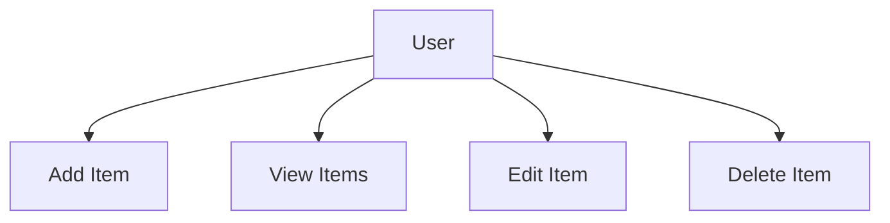

# Inventory App Design Document - Part 2: Use Cases

## 2. Use Cases

### Overview
This section identifies the primary use cases for the Inventory App, focusing on the **User** (e.g., inventory manager, shop owner) as the main actor. It outlines core interactions and previews future use cases for expansion.

### Use Case Diagram

### Core Use Cases
- **Add Item**: Create a new inventory item with details such as name, quantity, location, and description.
- **View Items**: Retrieve and display a list of all items or view a single item’s details.
- **Edit Item**: Update the details of an existing item.
- **Delete Item**: Remove an item from the inventory.

### Future Use Cases
- **Search Items**: Filter or search items by attributes like name, location, or category.
- **Categorize Items**: Group items by categories or tags for better organization.
- **User Authentication**: Restrict access to authorized users with role-based permissions.
- **Cross-Platform Sync**: Synchronize data across iOS (Swift) and Android (Kotlin) apps in real time.

### Summary
These use cases form the foundation of the app’s functionality, with detailed flows provided in the **Sequence Diagrams** (Part 4). Future use cases will be addressed in the **Enhancement Suggestions** (Part 10).