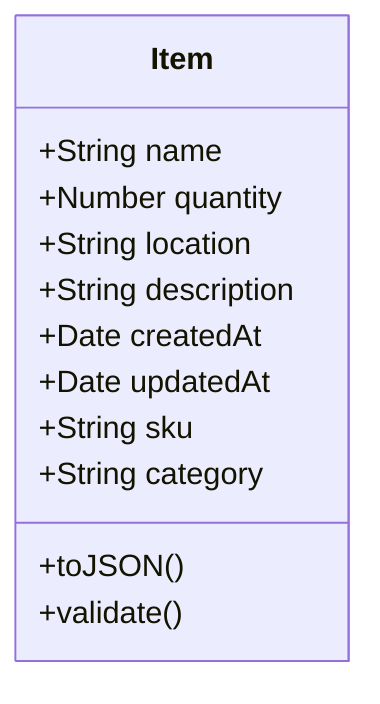

# Inventory App Design Document - Part 3: Data Model

## 3. Data Model

### Overview
The core data model for the Inventory App is the `Item`, representing an individual inventory entry. This section defines the `Item` model’s attributes, methods, and schema used in MongoDB.

### Class Diagram

### Item Model Details
- **Attributes**:
  - `name: String` (required, e.g., "Laptop"): The name of the item.
  - `quantity: Number` (required, e.g., 10): The stock quantity, must be >= 0.
  - `location: String` (optional, e.g., "Warehouse A"): The storage location.
  - `description: String` (optional, e.g., "Dell XPS 13"): Additional item details.
  - `createdAt: Date` (auto-generated): Timestamp of item creation.
  - `updatedAt: Date` (auto-generated): Timestamp of last update.
  - `sku: String` (optional, unique, e.g., "LAP123"): Stock Keeping Unit for barcode/QR code integration.
  - `category: String` (optional, e.g., "Electronics"): Category for grouping items.

- **Methods**:
  - `toJSON()`: Serializes item data for API responses, ensuring virtual fields are included.
  - `validate()`: Ensures required fields (`name`, `quantity`) meet constraints (e.g., `quantity` >= 0).

### MongoDB Schema (Mongoose)
The `Item` model is implemented in MongoDB using Mongoose for schema validation and indexing. This is further detailed in **Part 6: MongoDB Schema**.

### Notes
- The `Item` model supports extensibility for future features like categories and translations (see **Enhancement Suggestions**, Part 10).
- The MongoDB schema is referenced in the **API Design** (Part 5) for request/response formats.