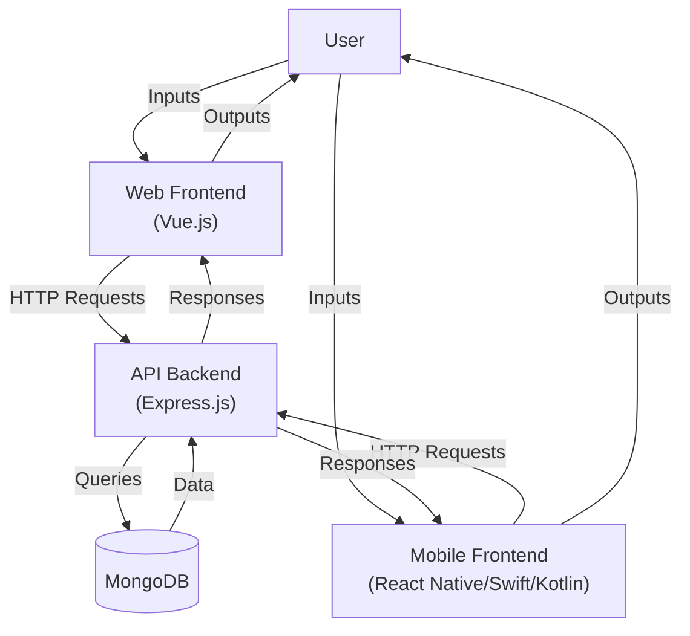

# Inventory App Design Document - Part 9: Data Flow Diagram

## 9. Data Flow Diagram

### Overview
The Data Flow Diagram (DFD) illustrates how data moves through the Inventory App system, from user interactions to database storage and back. It covers the web frontend (Vue.js), mobile frontend (React Native, Swift for iOS, Kotlin for Android), API backend (Express.js), and MongoDB database.

### Level-0 DFD (Context Diagram)
- **External Entity**: User
- **Process**: Inventory App System
- **Data Store**: MongoDB
- **Data Flows**:
  - **User Inputs**: Commands such as adding, viewing, editing, or deleting items.
  - **User Outputs**: Visual outputs like item lists, success messages, or error alerts.
  - **Item Data**: Read/write operations between the system and MongoDB.

### Level-1 DFD
- **External Entity**: User
- **Processes**:
  - **P1: Web Frontend (Vue.js)**: Handles user inputs via the browser and renders the UI.
  - **P2: Mobile Frontend (React Native/Swift iOS/Kotlin Android)**: Manages mobile inputs and displays screens.
  - **P3: API Backend (Express.js)**: Processes requests and interacts with the database.
- **Data Store**: **D1: MongoDB**: Stores item data.
- **Data Flows**:
  - User -> P1: Web inputs (e.g., form submissions, clicks).
  - User -> P2: Mobile inputs (e.g., taps, form data).
  - P1 -> P3: HTTP requests (e.g., POST /api/items, GET /api/items).
  - P2 -> P3: HTTP requests via Axios (React Native), URLSession (Swift), Retrofit (Kotlin).
  - P3 <-> D1: MongoDB queries (e.g., Item.find(), Item.save()).
  - P3 -> P1: HTTP responses (e.g., JSON item data).
  - P3 -> P2: HTTP responses.
  - P1 -> User: Rendered UI (e.g., item list, modals).
  - P2 -> User: Mobile screens (e.g., item list, forms).

### Visual Representation

### Notes
- This DFD provides a high-level view of data movement, complementing the **Sequence Diagrams** (Part 4) for specific use cases.
- Future enhancements like offline support (Part 10, Section 10.3) will extend the DFD with local storage flows.